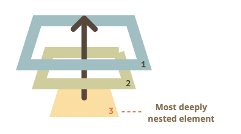
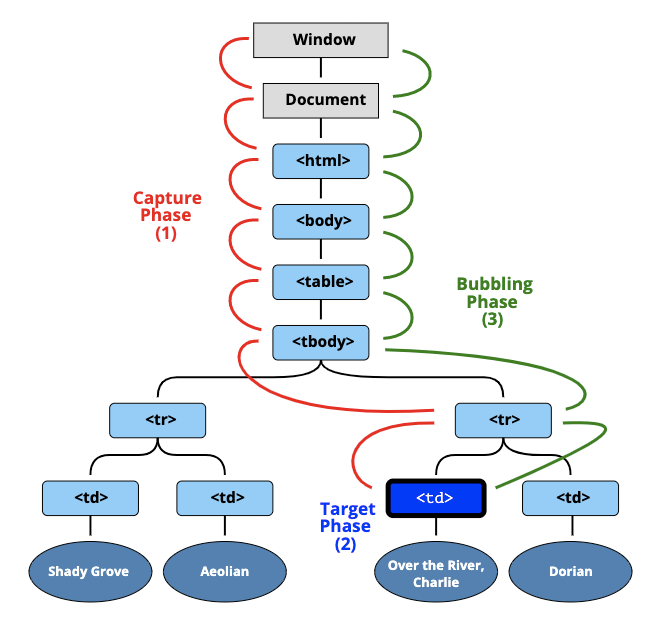

## Bubbling 버블링



- 한 요소에 이벤트가 발생하면, 이 요소에 할당된 핸들러가 동작하고, 이어서 부모 요소의 핸들러가 동작한다. 가장 최상단의 조상 요소를 만날 때까지 이 과정이 반복되면서 요소 각각에 할당된 핸들러가 동작한다.
- 거의 모든 이벤트는 버블링 된다. (단, focus 처럼 몇몇 이벤트는 제외)

> 위 그림에서 1번이 outer, 2번이 middle, 3번이 inner 라고 생각하면 된다

```jsx
outer.addEventListener("click", (event) => {
  console.log("outer");
});
middle.addEventListener("click", (event) => {
  console.log("middle");
});
inner.addEventListener("click", (event) => {
  console.log("inner");
});
```

- inner를 클릭하면 inner → middle → outer 순으로 출력
- middle을 클릭하면 middle → outer 순으로 출력
- outer를 클릭하면 outer만 출력

### event.target & event.currentTarget

#### event.target

- `event.target` 은 실제 이벤트가 시작된 요소를 말한다.
- 예를 들어서, 앞의 예시에서 p를 눌렀을 때 form까지 실행되었다. 이때 p의 event.target은 p이다. p를 클릭해서 이벤트가 시작되었기 때문이다.

#### event.currentTarget = this

- `event.currentTarget` 은 현재 실행 중인 핸들러가 할당된 요소를 말한다.
- 예를 들어서, 앞의 예시에서 p를 눌렀을 때 form까지 실행되었다. 이때 p의 event.currentTarget은 form이다. p로부터 이벤트가 시작되었지만, 결국 form까지 버블링되어 이벤트가 발생했기 때문이다.

### 버블링 중단하기

버블링되는 과정을 원치않아서 해당 이벤트만 처리하고 버블링을 하지 않도록 만들 수 있다

#### 👎 event.stopPropagation() & event.stopImmediatePropagation()

- `event.stopPropagation()`은 위쪽으로 일어나는 버블링은 막아주지만, 다른 핸들러들이 동작하는 건 막지 못한다. 따라서 버블링을 멈추고, 함께 등록된 핸들러의 동작도 막으려면 `event.stopImmediatePropagation()` 을 사용해야 한다.
- ⚠️ 하지만 위 두 메서드는 가능하면 사용하지 않는 것이 좋다. 나중에 협업을 하거나 분석을 하는 상황 등에서 문제가 생길 가능성이 매우 높고, 발견하기가 매우 어렵기 때문이다.

> event.stopPropagation() ⇒ inner를 클릭하면 inner1과 inner2 출력

```jsx
outer.addEventListener("click", (event) => {
  console.log("outer");
});
middle.addEventListener("click", (event) => {
  console.log("middle");
});
inner1.addEventListener("click", (event) => {
  console.log("inner1");
  event.stopPropagation();
});
inner2.addEventListener("click", (event) => {
  console.log("inner2");
});
```

> event.stopImmediatePropagation() ⇒ inner를 클릭하면 inner1만 출력

```jsx
outer.addEventListener("click", (event) => {
  console.log("outer");
});
middle.addEventListener("click", (event) => {
  console.log("middle");
});
inner1.addEventListener("click", (event) => {
  console.log("inner1");
  event.stopImmediatePropagation();
});
inner2.addEventListener("click", (event) => {
  console.log("inner2");
});
```

#### 👍 event.target !== event.currentTarget

- `event.stopPropagation()` `event.stopImmediatePropagation()` 이 두 메서드를 사용하지 않고, 다른 방법으로도 버블링을 막을 수 있다.
- 버블링이 발생하지 않기를 원하는 위쪽에 있는 요소들에게 조건을 추가해주면 된다. event.target과 event.currentTarget이 같을 때만 발생하도록 둘이 같지 않다면 바로 리턴하는 것이다.

> inner를 클릭해도 더 이상 middle, outer는 출력되지 않는다

```jsx
outer.addEventListener("click", (event) => {
  if (event.target !== event.currentTarget) {
    return;
  }
  console.log("outer");
});
middle.addEventListener("click", (event) => {
  if (event.target !== event.currentTarget) {
    return;
  }
  console.log("middle");
});
inner.addEventListener("click", (event) => {
  console.log("inner");
});
```

## Capturing 캡쳐링

- 버블링이 상위 요소로 올라갔다면, 캡쳐링은 반대로 하위 요소로 내려간다.
- 아래 그림처럼 td를 클릭하면 이벤트가 최상위 조상인 window에서 시작해 td까지 내려오는데 이를 캡쳐링이라 한다. 그리고 이벤트가 타깃 요소인 td에 도착해 실행을 한 후, 버블링을 통해 다시 위로 올라간다.



- 캡쳐링을 핸들링하는 경우는 거의 없다.

## Ref.

- [MDN bubbling and capture](https://developer.mozilla.org/en-US/docs/Learn/JavaScript/Building_blocks/Events#event_bubbling_and_capture)
- [버블링과 캡처링](https://ko.javascript.info/bubbling-and-capturing)
