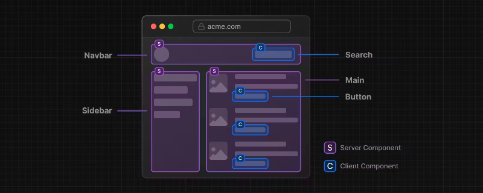
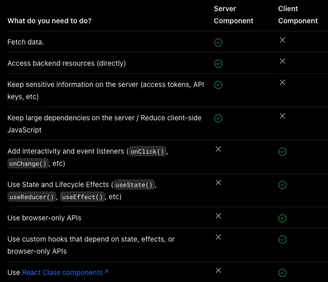

Next가 13 버전이 되면서 가장 큰 변화는 <mark>Server Component와 Client Component 컨셉의 지원</mark>이라고 생각한다. 그렇기 때문에 Next13을 사용하면서 Server Component와 Client Component의 이해없이 사용하게 된다면 기존 12 버전을 사용하는 것과 큰 차이가 없다고 할 수 있다.

> 즉, Next13 공식문서에서 얘기하는 아래 이미지처럼 컨셉을 이해한 후 해당 컴포넌트의 성격에 맞게 Server Component와 Client Component로 잘 나누는 것이 중요하다.

그렇다면 Server Component와 Client Component는 무슨 차이가 있을까.

## Server Component

Server Component는 React18에서 등장했는데, 기존 Client Component와 다르게 컴포넌트 서버에서 렌더링되기 때문에 초기 페이지 로딩 속도도 빨라지고 JavaScript 번들 크기가 줄어드는 등 성능적인 면에서 훨씬 좋다.

Next13에서는 모든 컴포넌트가 Server Component로 만들어지기 때문에 Client Component로 만들고 싶다면 `use client` 지시문을 파일 상단에 넣어주면 된다.

(+) 추가로 Server Component 개념이 더 궁금하다면 [이 글](https://tech.kakaopay.com/post/react-server-components/)을 참고하는 것을 추천한다!

## Client Component

Client Component는 client-side에서 동작하는 컴포넌트이다. Next에서 Client Component는 서버에서 미리 렌더되지만, client에서 hydrate되는 것으로 사실상 Next를 이용해 기존에 만들던 모든 컴포넌트가 이에 해당한다.

하지만 Next13부터는 위에서 언급한 것처럼 기본적으로 만들어지는 모든 컴포넌트가 Server Component이기 때문에 `use client` 지시문을 이용해 해당 컴포넌트를 Client Component로 동작하게 만들어야 한다.

## Server Component & Client Component를 어떻게 구분해서 사용해야 할까 🤔

Next13 공식문서에서 Server Component와 Client Component를 나누는 기준은 위와 같다.

### Server Component를 사용해야 할 때

- Fetch data : 데이터를 가져올 때
- Access backend resources(directly) : 직접적으로 백엔드 리소스에 접근할 때
- Keep sensitive information on the server (access tokens, API keys, etc) : access tokens, API keys 등과 같은 민감한 정보를 서버 위에서 유지할 때
- Keep large dependencies on the server / Reduce client-side JavaScript : 서버 위에서 큰 의존성을 유지할 때 / client-side에서 JavaScript 번들을 줄일 때

### Client Component를 사용해야 할 때

- Add interactivity and event listeners (`onClick()`, `onChange()`, etc) : `onClick()`, `onChange()` 등과 같은 이벤트 리스너나 상호작용을 추가할 때
- Use State and Lifecycle Effects (`useState()`, `useReducer()`, `useEffect()`, etc) : 상태를 사용하거나 `useState()`, `useReducer()`, `useEffect()` 등과 같은 React의 생명주기 메서드를 사용할 때
- Use browser-only APIs : 브라우저 전용 API를 사용할 때
- Use custom hooks that depend on state, effects, or browser-only APIs : 상태, React 생명주기 메서드, 브라우저 전용 API에 의존하는 커스텀 hook을 사용할 때
- Use [React Class components](https://react.dev/reference/react/Component) : React Class Component를 사용할 때 (개인적으로 함수형 컴포넌트를 주로 사용하기 때문에 크게 상관없지만, 이걸 보니 점점 클래스 컴포넌트를 사용할 일이 더 많이 줄어들 것 같다는 생각이 든다.)

## ✍

Next13 공식문서에서 Server Component와 Client Component를 나누는 기준을 명확하게 말해주고 있지만, 결국 나누는 기준은 단순하다고 생각한다. <mark>Client Component로 만들 수 밖에 없는 경우를 제외하면 Server Component로 만들기</mark> 라고.

# Ref.

- [https://nextjs.org/docs/getting-started/react-essentials](https://nextjs.org/docs/getting-started/react-essentials)
- [React 18: 리액트 서버 컴포넌트 준비하기](https://tech.kakaopay.com/post/react-server-components/)
