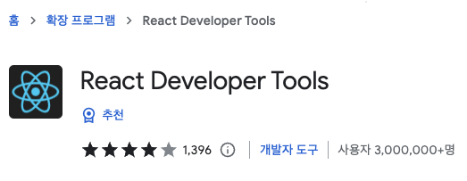
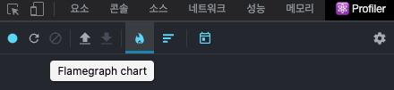
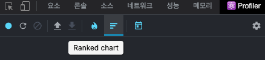

React Hooks는 React에서 기본적으로 제공해주는 hook으로 함수형 컴포넌트에 React의 다른 기능들을 연결해주는 것으로, use로 시작하는 함수들이다. 예를 들어, useEffect, useState, useMemo, useCallback 등이 있다. 이 중에서 useMemo와 useCallback은 렌더링 성능을 최적화하는 상황에서 사용하는 훅이다.

## useMemo

```tsx
const memoizedValue = useMemo(() => computeExpensiveValue(a, b), [a, b]);
```

Memo 는 "memoized" 를 의미하는데, 이는, 이전에 계산 한 값을 재사용한다는 의미를 가지고 있다. 이처럼 `useMemo` 를 사용하면 상황에 따라 이전 계산 값을 재사용함으로써 함수형 컴포넌트 내부에서 발생하는 연산을 최적화할 수 있다.

`useMemo` 의 첫 번째 파라미터에는 생성하고 싶은 함수를 넣고, 두번째 파라미터에는 deps 배열을 넣어주면 된다. 이 배열 안에 넣은 내용이 바뀌면, 첫 번째 파라미터에 넣은 함수를 호출해서 값을 연산해주고, 만약에 내용이 바뀌지 않았다면 이전에 연산한 값을 재사용하게 됩니다.

## useCallback

```tsx
const memoizedCallback = useCallback(() => {
  doSomething(a, b);
}, [a, b]);
```

`useCallback`을 사용하면 만들어놨던 함수를 재사용할 수 있다.

> `useMemo`와 비슷하게 렌더링 성능을 최적화해야 하는 상황에서 사용하는데, `useMemo`는 특정 결과 값을 재사용 할 때 사용하는 반면, `useCallback` 은 특정 함수를 새로 만들지 않고 재사용하고 싶을때 사용한다는 차이점이 있다.

`useCallback` 의 첫 번째 파라미터에는 생성하고 싶은 함수를 넣고, 두번째 파라미터에는 deps 배열을 넣어주면 된다. 이 배열에는 어떤 값이 바뀌었을 때 함수를 새로 생성해야하는지를 명시해주면 된다. 두 번째 파라미터에 빈 배열을 전달하면 컴포넌트가 렌더링될 때 만들었던 함수를 계속해서 재사용한다. 배열 안에 특정 값을 넣으면 해당 값이 바뀌거나 새로운 항목이 추가될 때 새로 만들어진 함수를 사용하게 된다.

위 내용만 보면 `useCallback`을 모든 함수에서 사용하는게 성능적으로 좋은 것이 아닌가🤔 라고 생각할 수도 있지만, `useCallback`을 사용하게 되면 메모리상에 계속 보관하기 때문에 메모리에 영향이 갈 수 있다. 따라서 `useCallback` 을 사용해야 될 때와 안될 때를 잘 구분하는 것이 중요하다.

## React.memo

```tsx
const MyComponent = React.memo(function MyComponent(props) {
  /* props를 사용하여 렌더링 */
});
```

`React.memo`는 컴포넌트의 props 가 바뀌지 않았다면, 리렌더링을 방지하여 컴포넌트의 리렌더링 성능 최적화를 해줄 수 있는 함수이다. `React.memo`를 사용하면 컴포넌트에서 리렌더링이 필요한 상황에서만 리렌더링을 하도록 설정해줄 수 있다.

> `React.memo`가 리렌더링 여부를 설정할 수 있다고 해서 렌더링을 방지하기 위해서 사용하면은 안된다고 한다. `React.memo`는 오직 **성능 최적화**를 위해서만 사용되어야 한다.

`React.memo` 는 props가 바뀌면 리렌더링된다. 이때 props가 바뀌었는지를 체크하기 위해서는 shallow 체크를 한다. 그렇기 때문에 **Memoized 된 component 에 object, fucntion을 props로 넘길 때는 반드시 `useCallback`, `useMemo`를 사용해서 넘겨야만 한다.**

(+) props를 체크하는 과정은 custom할 수도 있다. 아래 예시처럼 MyComponent의 props를 체크할 때 areEqual funciton을 이용하여 리렌더링을 조절할 수 있다.

```tsx
function MyComponent(props) {
  /* props를 사용하여 렌더링 */
}

function areEqual(prevProps, nextProps) {
  /*
  nextProps가 prevProps와 동일한 값을 가지면 true를 반환하고, 그렇지 않다면 false를 반환
  */
}

export default React.memo(MyComponent, areEqual);
```

## 언제 쓰는게 좋을까🤔

memo, useMemo, useCallback는 성능 최적화에 사용할 수 있는 hooks이다. 하지만 그렇다고 해서 항상 모든 값, 함수, 컴포넌트를 위 hooks를 사용해 memoized하는 것은 메모리에 항상 보관한다는 뜻이므로 메모리에 영향을 줄 수 있다. 따라서 expensive한 코드에 사용하는 것이 중요한데, 도대체 expensive한 코드가 무엇일까?
(사실 나는 이전에 expensive한 코드를 판단하는 것이 어려워서 memo, useMemo, useCallback hooks를 알고 있음에도 잘 안쓰는 경향이 있었다…ㅎㅎ)

### React Profiler



React를 쓰고 있다면 아마도 대부분 React Developer Tools라는 크롬 익스텐션을 사용하고 있을 것이라 생각되지만, 혹시라도 없다면 [https://chrome.google.com/webstore/detail/react-developer-tools/fmkadmapgofadopljbjfkapdkoienihi?hl=ko](https://chrome.google.com/webstore/detail/react-developer-tools/fmkadmapgofadopljbjfkapdkoienihi?hl=ko) 에서 설치할 수 있다.

React Developer Tools를 설치하고 나면 이제는 개발자 도구에서 Profiler를 통해 React Component의 성능을 측정할 수 있다.

- `highlight updates` : Profiler의 설정을 통해 <Highlight updates when components render.> 옵션을 켤 수 있다. 이 옵션을 켜게 되면, re-render되는 component의 테두리가 highlight되는 것을 확인할 수 있다.


- `Flamegraph` : Flamegraph에서 record를 통해 컴포넌트의 렌더링 속도를 측정할 수 있다. 이를 이용해 memo, useMemo, useCallback를 적용한 컴포넌트와 적용하지 않은 컴포넌트의 렌더링 속도를 비교해 렌더링 최적화를 하는 것이 효과적인지 여부를 결정하면 된다. 렌더링 속도가 비슷하다면 메모리에 영향을 미칠 수 있는 memo, useMemo, useCallback를 적용하기 보다는 적용하지 않는 편이 나을 수 있고, 렌더링 속도의 차이가 크다면 당연히 적용하는 것이 낫기 때문이다.



- `Ranked` : 컴포넌트 별로 렌더링된 시간을 기록한 차트로, Ranked를 이용하면 더 쉽게 컴포넌트의 렌더링 시간을 비교할 수 있다



> [React Profiler를 사용하여 성능 측정하기](https://medium.com/wantedjobs/react-profiler%EB%A5%BC-%EC%82%AC%EC%9A%A9%ED%95%98%EC%97%AC-%EC%84%B1%EB%8A%A5-%EC%B8%A1%EC%A0%95%ED%95%98%EA%B8%B0-5981dfb3d934) 글에 예시까지 포함하여 잘 정리되어 있다!

## Ref.

- [Hooks API Reference - React](https://ko.reactjs.org/docs/hooks-reference.html)
- [17. useMemo 를 사용하여 연산한 값 재사용하기](https://react.vlpt.us/basic/17-useMemo.html)
- [React Profiler를 사용하여 성능 측정하기](https://medium.com/wantedjobs/react-profiler%EB%A5%BC-%EC%82%AC%EC%9A%A9%ED%95%98%EC%97%AC-%EC%84%B1%EB%8A%A5-%EC%B8%A1%EC%A0%95%ED%95%98%EA%B8%B0-5981dfb3d934)
