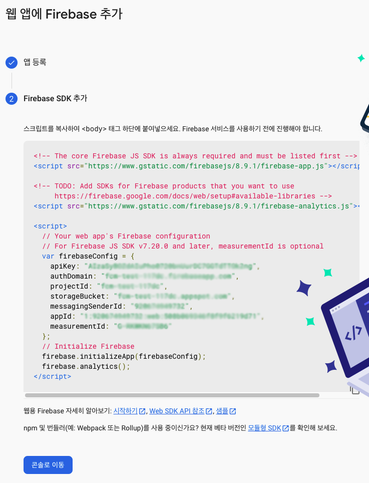
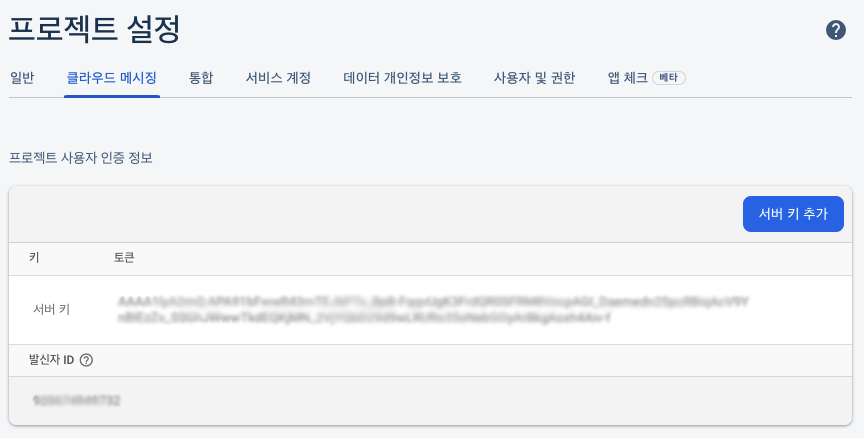
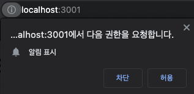
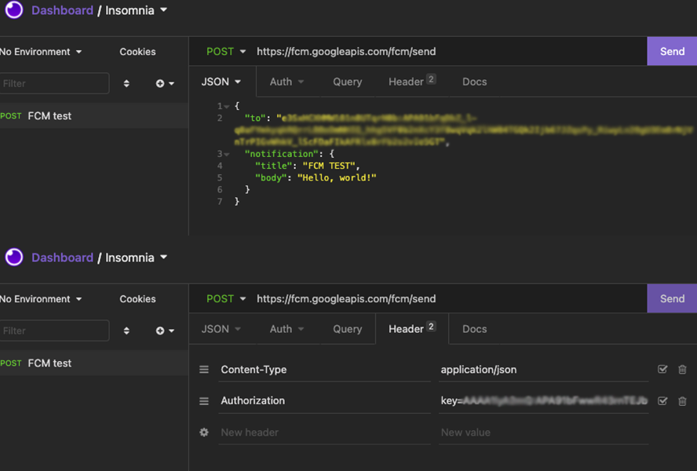

웹 프로젝트를 진행하면서 유저들간의 상호작용시 알림 기능 제공이 필요해 FCM을 통해 웹 푸시 기능을 구현하기로 했다. [FCM(Firebase Cloud Messaging)](https://firebase.google.com/docs/cloud-messaging?hl=ko)은 Firebase에서 제공해주는 서비스 중 하나로 이를 이용하면 Android, iOS 뿐만 아니라 웹에서도 **무료**로 알림 메세지를 전송할 수 있다.

단, 웹 프로젝트의 경우 FCM이 IE와 Safari에서는 동작하지 않는다. iOS 앱을 따로 만들 계획이라면 상관없지만, 모바일 웹을 계획하고 있다면 이 점을 유의해야 한다.

## Firebase 시작하기

FCM은 [Firebase](https://firebase.google.com/?gclid=CjwKCAjwmeiIBhA6EiwA-uaeFfLtxQ5CIgVIbj1c3vjUc7hlm8K7X1rLEXpnrcbypiqvPeO9JEoXVRoC2Y4QAvD_BwE&gclsrc=aw.ds)에서 제공해주는 서비스이기 때문에 가장 먼저 Firebase를 시작해야한다.

1️⃣ 구글 계정 로그인 후 Firebase 프로젝트 추가하기


2️⃣ 웹 프로젝트를 진행 중이기 때문에 `</>` 버튼을 눌러서 웹 앱에 Firebase 추가를 하게 되면 `firebaseConfig` 값을 알 수 있다.




3️⃣ 추가한 앱에서 프로젝트 설정- 클라우드 메시징 탭에 들어가면 서버 키를 확인할 수 있다. (만약 백에서 등록 토큰을 준다면 사실 프론트에서 서버 키를 몰라도 되긴 하지만, 나중에 테스트할 때 쓸 수 있으니 알아두면 좋다. ⚠️ 서버 키의 경우 보안이 중요하기 때문에 사용하게 된다면 꼭꼭 환경변수를 통해 git에 올리지 않도록 조심!)



## 리액트에서 Firebase 설정하기

1️⃣ 리액트에서 Firebase 모듈 설치

- yarn ⇒ `yarn add firebase`
- npm ⇒ `npm install firebase`

2️⃣ 사람마다 다르긴 하지만 나는 `firebase.js` 라는 파일을 통해 Firebase를 사용할 준비를 한다. `firebaseConfig` 값은 아까 위에서 확인한 그 값을 넣어주면 된다.

```jsx
// firebase.js

import firebase from "firebase";

const firebaseConfig = {
  apiKey: "",
  authDomain: "",
  projectId: "",
  storageBucket: "",
  messagingSenderId: "",
  appId: "",
  measurementId: "",
};

export const firebaseApp = firebase.initializeApp(firebaseConfig);
```

3️⃣ FCM 메세지 알림을 받기 위해서는 아래처럼 알림 권한을 요청 후 허용을 통해 등록 토큰을 가져와야한다. firebase의 messaging에 있는 함수 중 하나인 `requestPermission()` 으로 권한을 요청하고, 허용을 누를 경우 `getToken()` 함수를 통해 등록 토큰을 받을 수 있다.



```jsx
// app.js

import React from "react";
import { firebaseApp } from "./firebase";

const firebaseMessaging = firebaseApp.messaging();
firebaseMessaging
  .requestPermission()
  .then(() => {
    return firebaseMessaging.getToken(); // 등록 토큰 받기
  })
  .then(function (token) {
    console.log(token); //토큰 출력
  })
  .catch(function (error) {
    console.log("FCM Error : ", error);
  });
```

4️⃣ FCM에서는 `onMessage` 를 통해 알림 메시지를 받을 수 있다.

참고로 FCM은 백그라운드(화면을 보고 있지 않을 때 = 다른 사이트를 보고있을 때)에서만 웹 푸시 알림으로 오게 된다. 포그라운드(화면을 보고있을 때)에서는 아래처럼 알림을 콘솔에 찍도록 만들 수 있다. 나중에 전달되는 payload 값을 활용해 css 처리를 해주면 포그라운드에서는 직접 만든 알림을 보여줄 수 있다.

```jsx
// app.js

firebaseMessaging.onMessage((payload) => {
  console.log(payload.notification.title);
  console.log(payload.notification.body);
});
```

5️⃣ 마지막으로 Service Worker 설정을 해야 백그라운드 환경일때도 알림을 받을 수 있다.

- 리액트에서 Service Worker를 설정하기 위해서는 public 폴더 아래에 `firebase-messaging-sw.js` 라는 이름의 파일을 만들어줘야 한다. ⚠️ 반드시 파일명은 같아야 한다!

```jsx
// firebase-messaging-sw.js

importScripts("https://www.gstatic.com/firebasejs/8.7.1/firebase-app.js");
importScripts("https://www.gstatic.com/firebasejs/8.7.1/firebase-messaging.js");

firebase.initializeApp({
  apiKey: "",
  authDomain: "",
  projectId: "",
  storageBucket: "",
  messagingSenderId: "",
  appId: "",
  measurementId: "",
});

const messaging = firebase.messaging();
```

여기에 들어가는 `firebaseConfig` 값도 환경변수로 따로 설정하고 싶었지만, public 폴더 아래에서는 환경변수를 적용이 안되는 문제점이 발생해서 일단은 하드코딩을 통해 진행했다. 혹시라도 public 폴더 아래에서 환경변수를 적용하는 법을 아시는 분이 있다면 댓글로 꼭 알려주세요 ㅜㅜ🙏

아무래도 Firebase API Key를 공개하는 것에 부담이 있어 구글링을 했는데, [이 글](https://haranglog.tistory.com/25)을 참고했을 때 Firebase API Key를 공개한다고 해서 데이터가 해킹당하는 것이 아니고 단지 내 프로젝트에 연결만할 수 있다는 점을 확인 후 나도 일단 공개해도 괜찮다 라는 결론을 내렸다. 물론 공개한 이후에는 아무나 내 Firebase에 연결해 데이터를 넣을 수 있도록 보안규칙을 제대로 설정해야한다!

> app.js - 혹시라도 app.js 파일 전체가 궁금하신 분들은 아래 코드를 참고!

```jsx
import React from "react";
import { firebaseApp } from "./firebase";

const firebaseMessaging = firebaseApp.messaging();

firebaseMessaging
  .requestPermission()
  .then(() => {
    return firebaseMessaging.getToken(); //등록 토큰 받기
  })
  .then(function (token) {
    console.log(token); //토큰 출력
  })
  .catch(function (error) {
    console.log("FCM Error : ", error);
  });

firebaseMessaging.onMessage((payload) => {
  console.log(payload.notification.title);
  console.log(payload.notification.body);
});

function App() {
  return (
    <div className="App">
      <h1>FCM TEST</h1>
    </div>
  );
}

export default App;
```

## Insomnia를 이용해 직접 FCM 알림 전송하기

FCM 알림을 전송하는 방법에는 여러가지가 있다. 실제 프로젝트에서는 프론트에서 직접 전송하는 것이 아니라 백엔드에서 FCM 알림을 전송해주고 프론트에서는 전달받은 알림만을 처리해주고 있다.

하지만 백엔드가 없다는 가정하에 FCM을 사용해보려면 코드에서 직접 axios post요청을 날려주어도 되고, Insomnia와 같은 REST API 툴을 이용해도 좋다.

### Insomnia

Insomnia는 [공식 사이트](https://insomnia.rest/)에서 직접 다운로드 받으면 된다.

> FCM 알림 요청

- POST 요청을 `https://fcm.googleapis.com/fcm/send` 이 주소로 보내면 된다.
- body는 JSON 타입으로 아래 정보를 담으면 된다. 이때 `to` 에 들어가는 토큰 값은 위 코드 중 app.js에서 콘솔에 찍었기 때문에 콘솔에서 확인한 값을 복사해서 가져오면 된다.

```json
{
  "to": "토큰 값",
  "notification": {
    "title": "FCM TEST",
    "body": "Hello, world"
  }
}
```

- Header
  - Content-Type : application/json
  - Authorization : key=서버키 값
    - 여기서 서비키 값은 위에서 Firebase 시작하기 3번에서 얘기했으니 거기서 가져오면 된다.

> Insomnia에서 확인해보면 아래처럼 작성하면 된다. 그리고 Send 버튼을 눌렀을 때 success가 1로 찍힌다면 알림이 제대로 전송된 것이다.



## FCM 알림 확인하기

### Foreground

Foreground 포그라운드는 유저가 우리 서비스 화면을 보고 있을 때를 의미한다. 유저가 서비스를 이용하고 있다면 굳이 FCM 알림 메세지를 보내줄 필요가 없기 때문에 아래처럼 콘솔에 정보만 출력되는 것을 확인할 수 있다.


```jsx
// app.js

firebaseMessaging.onMessage((payload) => {
  console.log(payload.notification.title);
  console.log(payload.notification.body);
});
```

app.js에서 위와 같은 코드를 작성했기 때문에 메세지가 올 경우, 즉 payload가 전달되면 payload 안에서 notification 안에서 title과 body를 꺼내서 출력한 코드이다. title, body 외에도 click_action, icon 등을 전달받을 수 있고 웹이 아닌 iOS와 Android를 이용한다면 더 다양한 정보 값을 전달받을 수 있다. 이 내용은 [Firebase 공식문서](https://firebase.google.com/docs/cloud-messaging/http-server-ref)에서 확인 가능하다.

### Background

유저가 인터넷을 이용하고 있지만, 우리 사이트를 보고 있지 않다면 그 때는 Background 백그라운드 환경이기 때문에 직접 FCM 알림을 확인할 수 있다. 윈도우 환경은 오른쪽 아래 쪽에서 보이는 것으로 알고 있는데, 맥 환경은 오른쪽 위에서 알림이 온다.


## Ref.

- [[Firebase] FCM에 대해서 알아보자. 🔔](https://donghun.dev/Firebase-Cloud-Messaging)
- [React에서 FCM을 사용해봅시다.](https://gist.github.com/ninanung/3c3520359abed543a2bb8e09e49212e4)
- [node.js, FCM, 웹앱(서비스워커) 으로 푸시 구현하기.](https://medium.com/@sejongdekang/node-js-fcm-%EC%9B%B9%EC%95%B1-%EC%84%9C%EB%B9%84%EC%8A%A4%EC%9B%8C%EC%BB%A4-%EC%9C%BC%EB%A1%9C-%ED%91%B8%EC%8B%9C-%EA%B5%AC%ED%98%84%ED%95%98%EA%B8%B0-43c49b761dba)
- [Firebase Cloud Messaging HTTP protocol](https://firebase.google.com/docs/cloud-messaging/http-server-ref)
- [The API Design Platform and API Client](https://insomnia.rest/)
