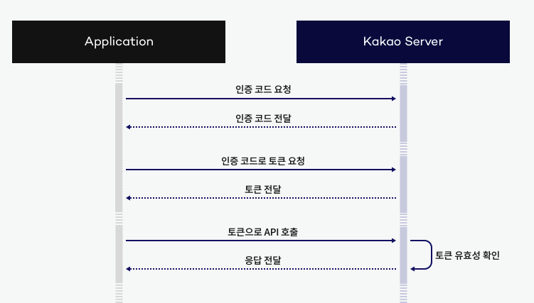

대부분의 서비스의 기본이자 시작은 로그인/회원가입 이라고 생각한다. 또한 프로젝트 개발을 본격적으로 시작하면서 아직 UI 디자인이 나오지 않았고, 프론트와 백을 나누어서 처음 제대로 협업하기에 가장 부담이 적은 개발 단계가 로그인/회원가입 기능이라 생각해 이 기능부터 작업을 하기 시작했다.

사실 생각보다 소셜 로그인 구현 과정이 이해가 잘 되지 않아서 삽질을 좀 했는데, 막상 이렇게 적고나니까 구현 과정 자체는 깔끔하다. 하지만 이 구현 과정 외에도 생각보다 많은 삽질을 했는데 (예를 들자면, 프론트와 백에서 통신하다보니까 CORS 에러가 발생했고, localhost.run을 이용해 주소를 적을 때는 https가 아닌 http로 해야 한다는 점 등등) 그것들은 자잘하기도 하고 애매해서 여기 적진 않았다.

🙏 프론트는 리액트로, 백엔드는 스프링 부트로 구현했다. 그리고 나는 프론트를 맡았기 때문에 이 글은 프론트 위주로 작성되어있다!

## 카카오 소셜 로그인

### 🤔 SDK? REST API?

카카오 소셜 로그인을 구현하기 위해서 [kakao developers의 카카오 로그인 문서](https://developers.kakao.com/docs/latest/ko/kakaologin/common)에 들어가면 다양한 방식의 카카오 로그인 구현 방식을 확인할 수 있다.


JavaScript SDK와 REST API 외에도 Android SDK와 iOS SDK로 구현하는 방법도 있지만, 우리 프로젝트는 웹 서비스이므로 JavaScript SDK와 REST API 중에서 고르면 된다.

구글링을 하다보면 두 가지 구현방식의 코드 모두 발견할 수 있는데, 처음 봤을 때는 JavaScript SDK 구현 방식이 더 쉬워보여서 이렇게 구현을 했었다. [이 글](https://velog.io/@seize/React-%EC%B9%B4%EC%B9%B4%EC%98%A4-%EC%86%8C%EC%85%9C-%EB%A1%9C%EA%B7%B8%EC%9D%B8)을 많이 참고했다.

하지만 우리 프로젝트에서는 카카오 로그인할 때 필요한 인증 코드를 백엔드로 보내서 백엔드에서 카카오 토큰을 받아서 자체 토큰으로 발행하기로 했기 때문에 프론트에서 카카오 토큰을 직접 전달받는 SDK 구현 방식은 맞지 않는 방법이었다. 따라서 카카오에서 받은 인증 코드를 백엔드로 넘기기 위해서는 `REST API` 방식을 통해서 구현해야 한다. (Kakao developers에서 어플리케이션을 추가하면 JavaScript 키와 REST API 키 모두 받을 수 있기 때문에 개인적으로 이 부분이 처음에 많이 헷갈렸고, 정리되지 않아서 오랜 시간 삽질을 했던 부분이었다.)

### 카카오 로그인 과정

[Kakao developers 문서](https://developers.kakao.com/docs/latest/ko/kakaologin/common)에서 제공되는 카카오 로그인 진행 과정은 아래와 같다.



위 그림의 경우 프론트와 백이 나누어져 있지 않기 때문에 처음에는 그림만 보고 이해하기 힘들었기 떄문에 위 과정을 [다른 분의 블로그 글](https://data-jj.tistory.com/53)을 참고해 실제로 우리 프로젝트의 순서로 (프론트 위주로) 다시 만들면 아래와 같다.

> 프론트 위주의 카카오 로그인 구현 과정


#### 1. 인증 코드 요청

[카카오 로그인의 REST API 문서](https://developers.kakao.com/docs/latest/ko/kakaologin/rest-api)를 확인해보면 아래와 같이 나와있다.


즉, `GET` 으로 `/oauth/authorize?client_id={REST_API_KEY}&redirect_uri={REDIRECT_URI}&response_type=code` 이 주소로부터 인증 코드를 받아올 수 있다는 뜻이다. Host가 `kauth.kakao.com` 이므로 GET으로 요청하는 URL은 최종적으로 다음과 같다.

```
https://kauth.kakao.com/oauth/authorize?client_id={REST_API_KEY}&redirect_uri={REDIRECT_URI}&response_type=code
```

- REST_API_KEY는 kakao developers에서 어플리케이션을 만들었을 때 제공되는 앱 키 중 REST API 키를 말한다.
- REDIRECT_URI는 말 그대로 리다이렉트 되는 주소로 프론트엔드와 백엔드가 서로 잘 합의해서 정하면 된다. 우리는 `${process.env.REACT_APP_BACK_LOCALHOST_URL}/auth/kakao/callback` 으로 정했다.
- (+) 이 때 host(`REACT_APP_BACK_LOCALHOST_URL`)는 프론트엔드가 접근할 수 있어야 한다. 따라서 우리는 백엔드 localhost를 다른 사람도 접근 가능하도록 주소를 만들어서 그 주소를 넣었다. 다른 사람이 나의 로컬호스트를 확인할 수 있도록 만들어주는 localhost.run 에 관한 내용은 [여기서](https://2dowon-log.netlify.app/etc/localhost_run/) 확인할 수 있다

#### (+) kakao developer에서 사이트 도메인, Redirect URI 등록하기

[kakao developer](https://developers.kakao.com/)에 접속해서 내 어플리케이션을 추가했다면 앱 설정 중 플랫폼에서 사이트 도메인과 Redirect URI를 등록할 수 있다.

> 내 어플리케이션 - 앱 설정 - 플랫폼


아직 배포를 하지 않았기 때문에 localhost 주소를 등록했다. 리액트이므로 포트번호는 3000으로! (이상하게 적다보면 https를 적는 실수를 종종 했는데, http로 적어야 한다. s 꼭 빼기!!)

저기서 이제 `등록하러 가기` 버튼을 누르면 Redirect URI를 등록할 수 있다. Redirect URI는 아까 위에서 정한 것을 넣어주면 된다.

> 내 어플리케이션 - 앱 설정 - 플랫폼 - Redirect URI 등록하러 가기 - 활성화 설정 ON


### 2. 인증 코드를 받아서 백엔드로 전달


위 사진처럼 인증 코드를 받으면 아까 REDIRECT_URI로 설정한 `/auth/kakao/callback` 뒤에 인증 코드가 `code` 라는 이름의 파라미터로 전달되어서 리다이렉트 된다. `code` 값을 백엔드로 전달하기 위해 아래 코드를 이용하면 url에서 원하는 값만 받아올 수 있다.

```jsx
const href = window.location.href;
let params = new URL(document.location).searchParams;
let code = params.get("code");
```

인증 코드 `code` 를 받아왔으니 이제 백엔드로 전달을 해줘야 한다. 백엔드에서 API를 만들어주면 해당 주소로 보내주면 된다.

```jsx
const kakao = async () => {
  try {
    const result = await axios.get(
      `${process.env.REACT_APP_BACK_LOCALHOST_URL}/api/v1/oauth2/authorization/kakao?code=${code}`
    );
  } catch (error) {
    console.log("error", error);
  }
```

#### 3. 백엔드에서 자체 토큰을 프론트로 전달

백엔드로 인증 코드를 전달했으니 이제 백엔드에서 인증 코드를 가지고, 카카오로부터 토큰을 받아오고 해당 토큰을 자체 토큰으로 재발행해서 프론트로 넘겨주면 된다. 우리 서비스의 경우, 백엔드에서 정보를 받을 때 회원가입 여부도 같이 받기 때문에 그 값에 따라서 바로 홈으로 리다이렉트할 것인지, 회원가입 화면으로 이동시킬지 결정하면 된다.

## 네이버 소셜 로그인

네이버 소셜 로그인하는 법도 카카오와 거의 동일하다. 따라서 과정은 위에서 카카오 로그인 구현 과정을 참고하면 된다. 단, 아까 카카오에서 REST API 값을 사용했다면, 네이버에서는 Client ID 값을 사용해야 한다. 이 값은 [네이버 개발자센터](https://developers.naver.com/apps/#/wizard/register)를 통해 애플리케이션을 등록하면 확인할 수 있다. 그리고 카카오 로그인을 할 때는 없었던 `state` 값이 있다.

#### 1. 인증 코드 요청


위 샘플처럼 GET으로 요청하는 URL은 최종적으로 다음과 같다.

```
https://nid.naver.com/oauth2.0/authorize?response_type=code&client_id={CLIENT_ID}&state={STATE_STRING}&redirect_uri={CALLBACK_URL}
```

- CLINET_ID와 STATE_STRING은 네이버 개발자센터에서 앱을 등록해 확인할 수 있다
- CALLBACK_URL도 아까 카카오에서 했듯이 프론트와 백엔드가 협의해서 정하면 된다. 우리는 `${process.env.REACT_APP_BACK_LOCALHOST_URL}/auth/naver/callback` 으로 정했다
- 참고로 CALLBACK_URL(REDIRECT_URI)는 카카오의 경우, 앱 등록 이후 따로 설정했는데 네이버는 앱을 등록할 때부터 신청하는 것 같다.


#### 2. 인증 코드를 받아서 백엔드로 전달


위 사진처럼 인증 코드를 받으면 아까 REDIRECT_URI로 설정한 `/auth/naver/callback` 뒤에 인증 코드가 `code` 라는 이름의 파라미터로 전달되고, state도 `state` 라는 이름의 파라미터로 전달되어서 리다이렉트 된다. `code` 값과 `state` 값을 백엔드로 전달하기 위해 아래 코드를 이용하면 url에서 원하는 값만 받아올 수 있다.

```jsx
const href = window.location.href;
let params = new URL(document.location).searchParams;
let code = params.get("code");
let state = params.get("state");
```

인증 코드 `code` 와 `state` 를 받아왔으니 이제 백엔드로 전달을 해줘야 한다. 백엔드에서 API를 만들어주면 해당 주소로 보내주면 된다.

```jsx
const naver = async () => {
  try {
    const result = await axios.get(
      `${process.env.REACT_APP_BACK_LOCALHOST_URL}/api/v1/oauth2/authorization/naver?code=${code}&state=${state}`
    );
  } catch (error) {
    console.log("error", error);
  }
```

이 이후는 카카오와 동일하게 백엔드로 인증 코드와 state를 전달했으니 이제 백엔드에서 인증 코드를 가지고, 네이버로부터 토큰을 받아오고 해당 토큰을 자체 토큰으로 재발행해서 프론트로 넘겨주면 된다

## Ref.

- [Kakao Developers](https://developers.kakao.com/docs/latest/ko/kakaologin/common)
- [네이버아이디로그인 개발가이드 - LOGIN](https://developers.naver.com/docs/login/devguide/devguide.md#%EB%84%A4%EC%9D%B4%EB%B2%84%EC%95%84%EC%9D%B4%EB%94%94%EB%A1%9C%EA%B7%B8%EC%9D%B8-%EA%B0%9C%EB%B0%9C%EA%B0%80%EC%9D%B4%EB%93%9C)
- [REST-API 활용한 카카오 소셜 로그인 구현(feat. React)](https://data-jj.tistory.com/53)
