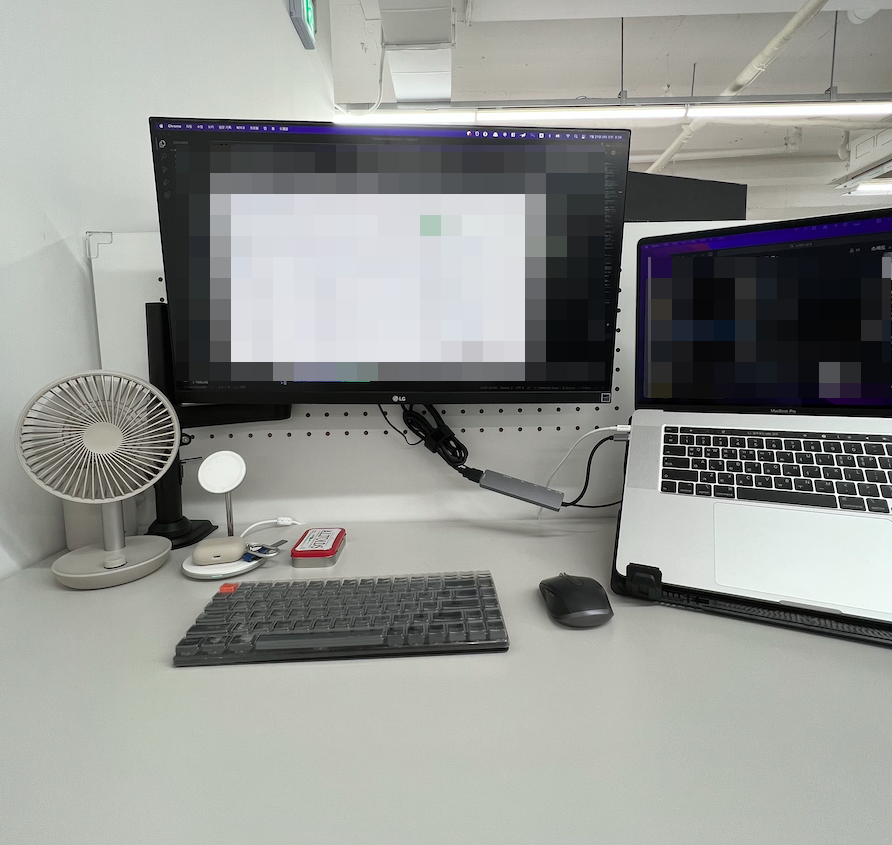
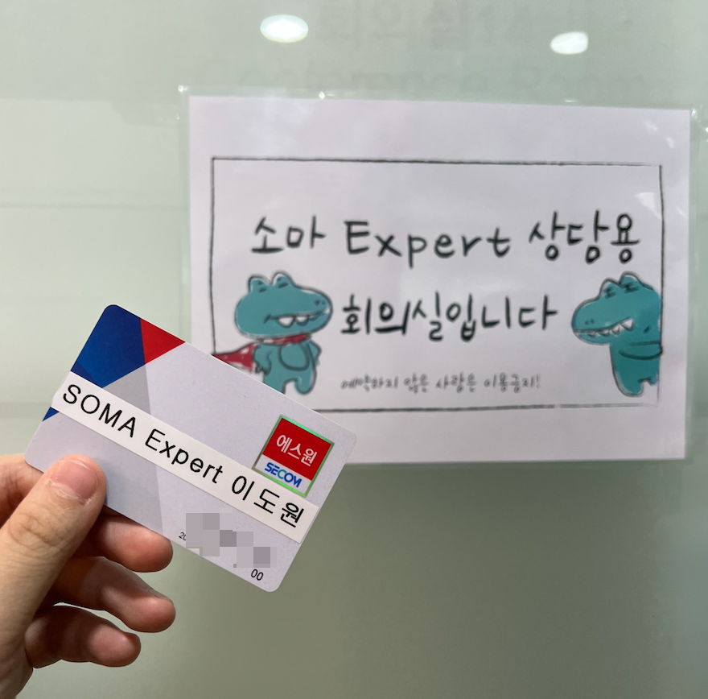
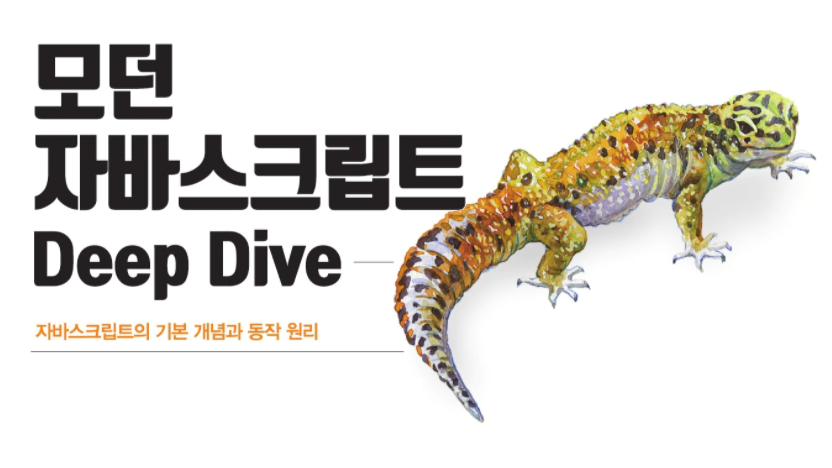
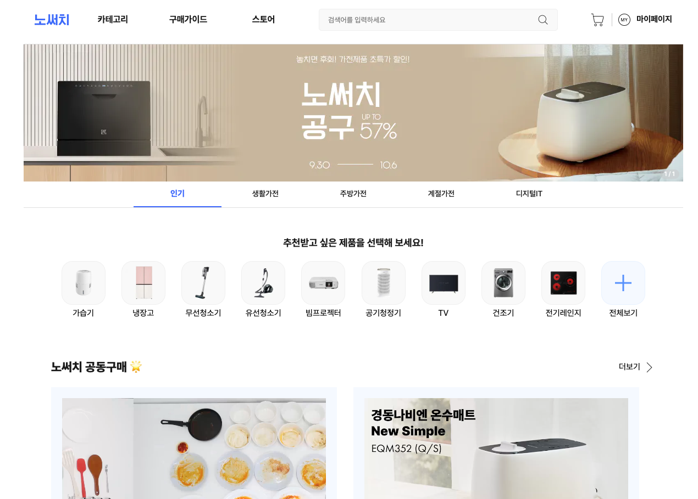
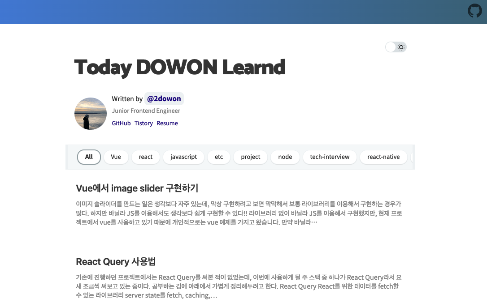
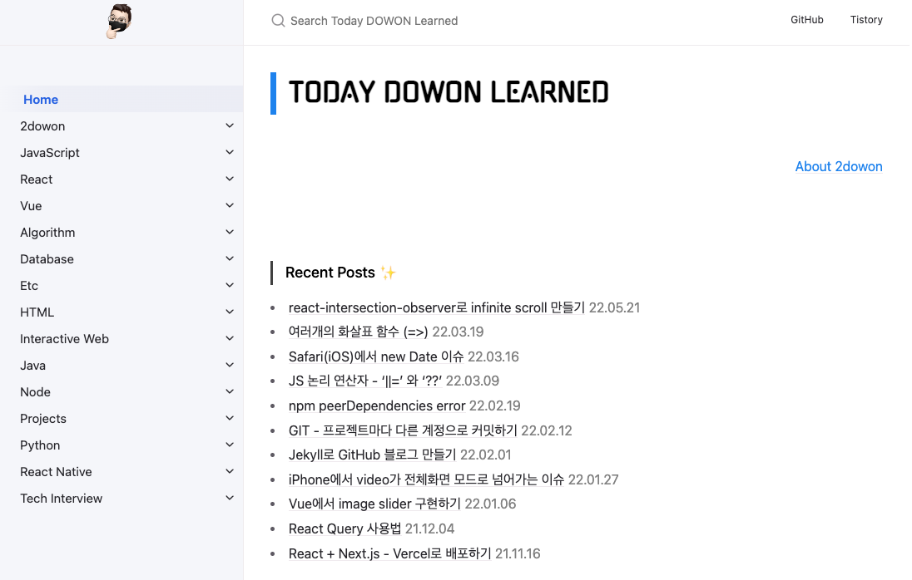
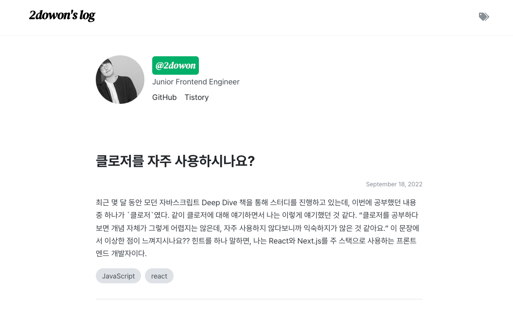
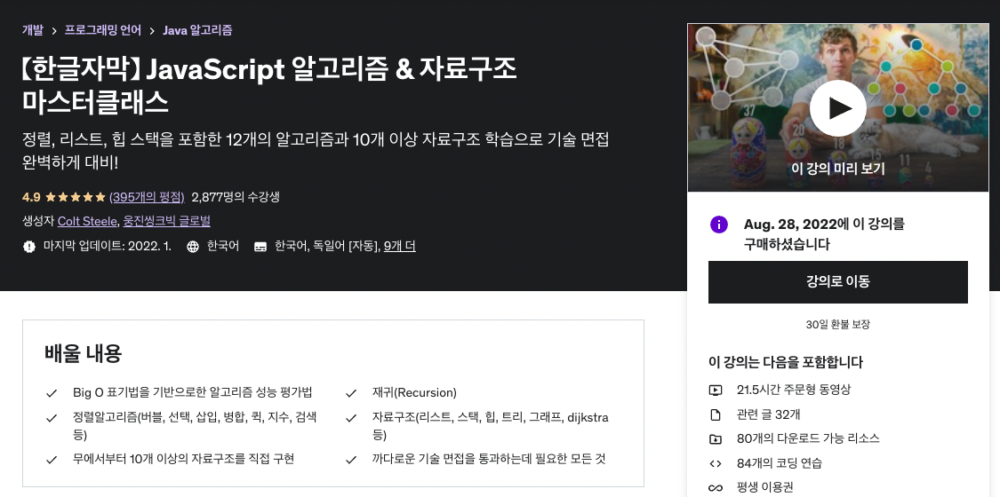
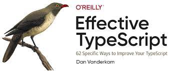
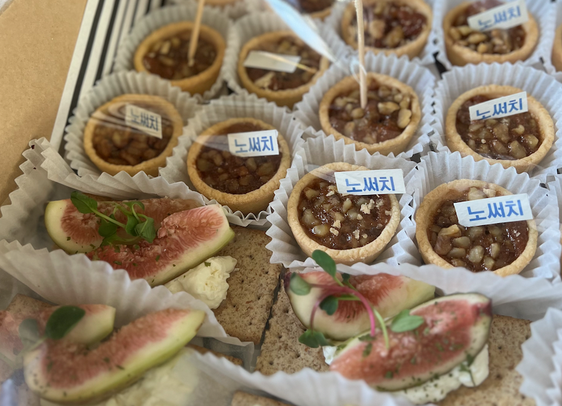

## 7월

### 사무실 이사 🎉

드디어 회사 사무실이 가산에서 역삼으로 이사했다! 내 자리만 찍어서 좀 칙칙해보이는 느낌이 들 수 있는데, 회사 인테리어가 전체적으로 화이트톤이여서 딱 들어가면 '깔끔하다'라는 느낌이 많이 든다. 자리도 예전보다 좀 더 넓어졌고, 무엇보다 모니터 암이 설치되면서 공간도 넓어진 느낌이라 좋다 ㅎㅎ 사무실이 강남으로 이사가면서 재택 문화가 없어져 그건 좀 아쉽긴 한데, 그래도 가산일때는 거의 왕복 3시간 정도 걸리던 출퇴근 시간이 이제는 1시간 30분에서 2시간 정도 걸리니까 거의 절반 가까이 줄었다! (역시 회사는 가까운게 짱이야...)

강남으로 와서 안 좋아진건 점심 식비가 많이 든다는 거였다. 아무래도 가산에 있다가 강남 오니까 주변 물가가 많이 비싸더라ㅜㅜ 그래서 저번달에는 도시락도 싸고 그랬었는데, 10월부터는 회사 복지에 식비 지원이 추가되면서 앞으로 도시락 먹을 일은 거의 없지 않을까 싶다!! 특히 샐러드는 비싸서 자주 못 사먹었는데, 종종 사먹어야지 이제.

### 소마 엑스퍼트

사실 소마 엑스퍼트는 7월은 아니고 6월부터 시작했다. 작년까지는 소마 엑스퍼트라는 활동이 없었는데, 올해부터 소마 연수생들이 소마에 좀 더 빠르게 적응하고, 무사히 수료까지 할 수 있도록 옆에서 친구같은 존재가 되어줄 수 있는 활동의 의미로 생겼다. 사실 그래서 나는 내가 비전공자이기도 하고, 그래서 소마 활동 초반에 조금 겁을 먹었다고 해야 되나.. 전공생들과 잘하는 수 많은 사람들 사이에 내가 껴있어도 되나 같은 마음이 있었어서 나와 비슷한 상황인 연수생들을 만나고 싶다는 마음이 있었는데, 어쩌다보니 내가 맡은 연수생들은 모두 전공생이었다 ㅎㅎ 처음에는 나보다 잘하는(?) 친구들과 무슨 얘기를 하지 라는 걱정이 쪼금 있었는데, 어차피 엑스퍼트 활동은 프로그래밍에 관한 지식보다는 소마 활동에 초점이 맞추어져 있기 때문에 크게 걱정할 필요는 없지 않았나 싶다. 처음에는 어색하고, 그래서 다같이 밥먹고 맥주 한잔씩 하고 그랬었는데, 이제는 조금은 친해져서 그런지 앞으로 몇 번 안남았다는 사실이 조금 아쉽고 그러넹.

### 모던 자바스크립트 Deep Dive 스터디

모던 자바스크립트 Deep Dive 책은 사실 산지는 좀 오래 됐는데, 항상 공부하다가 궁금한 개념이 있으면 부분적으로 찾아보기만 하고, 처음부터 끝까지 제대로 읽어본 적은 없었다. 근데 이번에 좋은 기회가 생겨서 서로 부담이 가지 않는 선에서 2주에 1번씩 만나 책을 읽는 스터디를 진행하게 되었다. 2주에 한번씩 만나고, 약 5장 정도를 읽기 때문에 부담스럽지 않다는 점에서는 좋지만 아무래도 거의 6개월 동안 진행해야 되다보니 조금 호흡이 길지 않나라는 생각도 들고.. 🤔 스터디를 주도적으로 하는 건 처음이였는데, 아무래도 다음 스터디부터는 호흡을 조금 짧게 가져가는 것도 좋겠다는 생각이 든다.

스터디 내용은 노션에는 가볍게 정리해두는데, 책 내용을 정리하고 거기에 내용을 조금 보충해놓는 정도여서 따로 글은 올리지 않고 있다. 그래도 책을 읽으면서 한번쯤 정리해보고 싶었던 내용은 더 깊게 공부해서 정리해두려고 하는데, 최근에 그렇게 올린 내용으로는 ["클로저를 자주 사용하시나요?"](https://2dowon.com/javascript/do-you-use-clouser-often/)가 있다. 다음 회고 때는 스터디가 끝나있을 것 같은데, 끝까지 잘 마무리 되었으면 좋겠다아

## 8월

### 노써치 리뉴얼 프로젝트

드디어 8월 초에 노써치 v2 리뉴얼 프로젝트가 배포되었다. 노써치 v2 프로젝트는 올해 2월부터 얘기가 나왔고, 3월 말부터 본격적으로 맡아서 진행한 프로젝트였는데 이번에 회사에서 shape-up을 진행하면서 첫 cycle의 프로젝트가 중 하나가 노써치 v2였고, 이번 cycle이 끝나면서 드디어 배포하게 되었다.

사실 100% 완전하게 모든 기능을 v1에서 가져오지는 못했지만, React 버전을 18로 업그레이드하고 Next.js의 버전도 12로 업그레이드했고, 그 외에도 npm 대신 yarn berry를 사용하고, recoil 대신 jotai와 zustand, chakra, styled-jsx 대신 tailwind, vercel 배포 등이 달라졌다. 덕분에 서비스 속도가 많이 빨라졌고, 특히 웹앱으로 구현된 앱의 속도가 많이 빨라졌다.

리뉴얼 프로젝트를 진행하면서 v1과 시안이 많이 달라지고, v1에서는 대부분의 UI를 chakra를 이용해 구현한 경우가 많아 UI는 대부분 새롭게 구현했다. v2로 넘어가면서 v1에서는 사용하지 않았던 storybook을 사용하게 되었는데, storybook을 사용하다보니 불필요하게 dev환경에서 UI를 테스트하지 않아도 되고, storybook에서 어떤 UI가 구현되어 있는지 확인이 가능하다는 점이 좋았다. 그리고 사실 UI를 처음 구현할 때는 dynamic하게 구현하지 못했었다. 즉, 확장 가능성이 매우 떨어지게 구현했고 어떤 페이지냐에 따라 다른 스타일을 줌으로써 코드만 봐서는 어떤 스타일이 적용된 코드인지 알 수 없게 구현한 경우가 많았다. 리뉴얼 프로젝트 중간에 시니어 프론트엔드 개발자 분이 들어오시면서 코드리뷰를 받아 알게 된 점이었는데, 그 덕분에 진짜 코드가 많이 깔끔해지고 있다. 지금도 아직 리팩토링하지 못한 dynamic하지 못한 코드를 보면 수정할 때 많이 머리를 짚게 되는데, 시니어 분이 리뉴얼 후에 들어오셨으면 정말 진짜....ㅎ 뭐 하나 수정할 때마다 난리나지 않았을까.. 그러면서 깨우쳤겠지 ㅎ

쨋든 과장 조금 보태서 회사 들어와서 이것만 했다고 해도 봐도 될 정도이고, 그만큼 많은 시간을 투자했던 v2가 드디어 배포되어서 진짜 진짜 기뻤다. 부족한 부분들이랑 오류들은 빨리 고쳐나가야지.

### Gatby 블로그

블로그를 다시 새롭게 만들었습니다!! ㅎㅎ 아니 솔직히 1년만에 3번째 블로그라 슬슬 민망하긴 한데... 네 뭐 그렇습니다.

> 첫 번째 블로그
> 

첫 번째 블로그는 JBEE님의 [gatsby-stater-bee](https://github.com/JaeYeopHan/gatsby-starter-bee)를 이용해서 만든 Gatsby 블로그였다. 국비학원을 다니고 있을 때 처음에 티스토리를 만들었가 글을 올릴 때마다 잔디를 심지 못하는게 그 당시에는 ~~너무~~ 억울했어서 github 블로그를 만들어봐야겠다 라고 만든 블로그였다. 그러고보니까 티스토리 블로그까지 생각하면 이게 첫번째 블로그도 아니네..ㅋㅋㅋ 쨋든 그 당시에 Jeykyll이나 다른 방법으로 만드는 법도 많았는데, 그때는 그냥 당장 쉽게 만들 수 있는 예쁜 블로그가 제일 포인트였어서 이 템플릿을 이용해 만들었었다.

> 두 번째 블로그
> 

두 번째 블로그는 Jekyll를 이용해서 만든 블로그였다. 사실 이때는 블로그를 다시 만들 계획은 없었는데, Gatsby로 만든 첫 번째 블로그가 배포가 안되면서 어쩔 수 없이 만들게 되었다. 그 당시에는 아무리 찾아도 이유를 모르겠어서 차라리 다시 만드는게 쉽겠다 싶어서 만든거였는데, 지금 생각해보면 gatsby 버전 문제였던거 같기도 하고 그렇다. 쨋든 처음에 Jekyll로 만들려다 실패했던 기억도 있고, github.io 로 끝나는 URL이 가지고 싶기도 했고, 옆에 토글로 메뉴를 열 수 있다는게 좀 깔끔해보이기도 해서 만들게 되었다.

> 세 번째 블로그 (현재)
> 

Jekyll 블로그를 막상 만들고 났는데, 너무 못생긴거다... 너무 올드한 느낌이 많이 들었고 디자인을 다 갈아엎자니 Jekyll 블로그가 ruby 언어를 기반으로 만들어서 좀 낯설기도 하고 그래서 결국 첫번째 블로그였던 Gatsby로 돌아가기로 했다. 근데 테마는 요즘에는 첫번째 블로그의 테마가 너무 많이 보이기도 하고, 이제는 커스텀도 할 수 있을 것 같아서 [gatsby-starter-blog](https://www.gatsbyjs.com/starters/gatsbyjs/gatsby-starter-blog/) 라는 Gatsby에서 제공해주는 가장 단순한 디자인의 블로그 테마를 가져와서 조금씩 스타일 수정을 하면서 사용하는 중이다. 내 취향이 가장 많이 들어가서 그런지, 아직까지는 질리지도 않고 꽤 만족스럽다 ㅎㅎ 다만, sitemap 처리가 잘 안되어서 SEO가 와장창 깨졌는데... 음 이건 천천히 고쳐봐야겠다.

### JS 알고리즘 & 자료구조

코딩 테스트를 감을 잃지 않으려고 2주에 최소한 5개는 풀 수 있도록 하고 있다. 꾸준히 풀다보니까 예전보다 나아지기는 했는데, 문제가 어려워질수록 기본 알고리즘이나 자료구조에 대한 지식이 너무 없다는 생각과 동시에 Udemy에서 이 강의를 할인하고 있어서 사버렸다. 강의가 길지는 않아서 출퇴근할 때 지하철에서 보면 좋겠다 싶어서 몇번 봤는데, 아침에는 사람이 많아서 정신이 없고 저녁에는 퇴근하자마자 공부하기가 너무 싫어가지고...ㅎㅎ 강의를 아직 많이 못 들었다. 진짜 봐야되는 강의가 너무 많은데... 진짜 모각코라도 구해야하나 싶다. 소마 엑스퍼트 끝나면 시간이 좀 생길려나ㅜㅜ 올해 안에는 가볍게라도 듣고 싶은데 진짜.

## 9월

### 이펙티브 타입스크립트 스터디

사내에서 이펙티브 타입스크립트 스터디를 시작했다. 주로 사용하는 언어가 타입스크립트인만큼 타입스크립트의 기본기를 다질 수 있는 책으로 일주일에 2 chapter씩 빠르게 한 달만에 진행하는 스터디이다. 이 책도 맨날 읽어야지 했던 책 중 하나였는데, 이번에 스터디를 하면서 읽다보니 당연한데? 라고 생각하는 내용도 많았고 아무 생각 없이 썼는데, 생각보다 중요한 내용도 많았다. 이제 2주정도 남았는데, 이번 스터디는 끝나고나서 기억 남는 내용을 글로 작성해 커뮤니티 등에 기고한다고 해서 걱정반 설렘반이다. 쨋든 스터디 다 끝나면 스터디 회고에서 더 자세히 적어보자!

### 워크샵

~~워크샵 사진이 다른 사람들은 더 좋은 것도 찍었을꺼 같은데, 나는 왜 이것만 있지..ㅎ~~

9월 마지막 날, 회사에서 첫 워크샵을 했다. 사실 나는 회사 들어오고 첫 전체 회식이기도 한데, 워크샵은 완전 처음이라고 들었다. 이번에 pre-A 투자를 받고, 강남 이사오고 그러면서 다같이 다음 투자때까지 열심히 달려보자는 의미같기도 하고, 다같이 친해져보자 느낌도 있고 그렇다. 쨋든 워크샵 덕분에 어렴풋이 알고 있던 회사의 가치관이나 비즈니스 모델 등을 좀 더 제대로 알 수 있게 되었고, 다른 팀 분들도 드디어 얼굴과 이름이 매치되기 시작했다. 솔직히 거의 1년 다녔으면서 제대로 이름도 못 외웠다는 사실이 민망하긴 한데, 그만큼 소통할 일이 없었따ㅜㅜ 이제는 랜덤 커피챗 등 다양한 회사 문화가 생겨나고, 분기마다 워크샵이나 전체 회식을 하게 되면 진짜 더더 친해지지 않을까!!ㅎㅎ

이번 워크샵을 기점으로 내가 스타트업에 다니고 있다는 사실이 좀 더 와닿는 기분이기도 하다. 이제 주니어 프론트만 들어오면 된다.. 제발 1명만.. 그 빈자리만 채워졌으면 좋겠다. 최근에 개발팀 주니어 프론트 한 분이 이직을 하셨는데, 그 분이 나랑 비슷한 영역의 업무를 맡고 있어서 일이 늘지 않았지만 일이 는 느낌이랄까... ~~그냥 부담감만 조금.. 뭐... ㅎ~~ 워크샵 전에 새로운 분이 들어오시지 않을까 했는데, 쨋든 그건 아니였지만 조만간 곧.. 들어오겠지 ㅎㅎ..

 

---

 

월간 회고를 작성하면 쓸 게 생각보다 없길래 분기 회고로 바꿨는데, 세달치를 쓰려니까 은근 많은거 같기도 하고 🤔 그치만 지금 분기도 귀찮은데, 월간으로는 백퍼 못 쓸 것 같으니까 일단은 분기라도 꾸준히 써봐야겠다. 티스토리에도 얼른 블로그 옮겼다는 공지 올려야 하는데 계속 못 올리고 있다. 티스토리 방문하시는 분들 대부분은 소마 후기로 오는 것 같기는 한데, 그래서 아예 없애버리기는 조금 그렇고 쨋든 조만간 공지나 하나 올려야겠다!

다음 회고 쓸때면 4분기 회고 겸 연간 회고 겸 프론트엔드 개발자의 1년 회고 겸이 될텐데, 어떻게 잘 쪼개서 올릴지 생각해봐야지!
