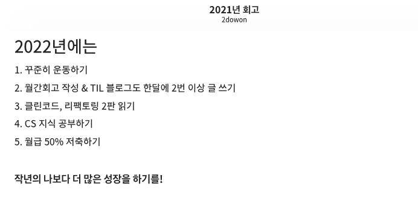
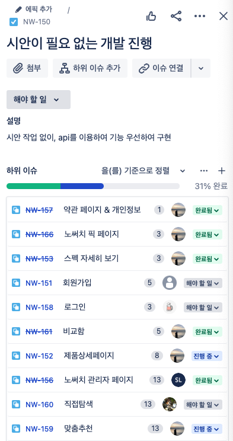
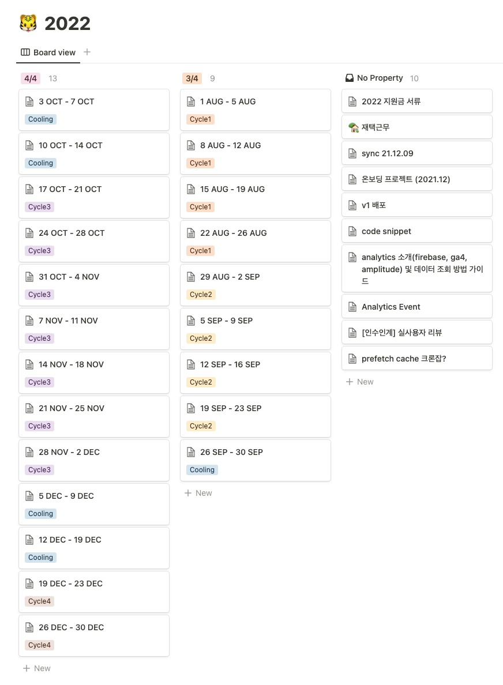
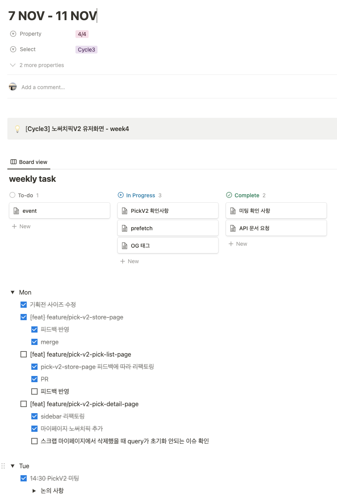
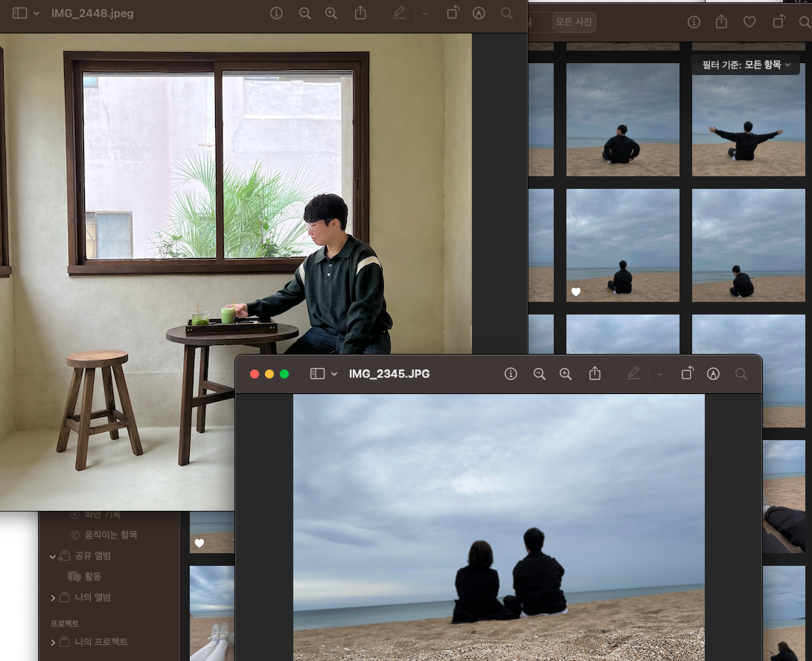
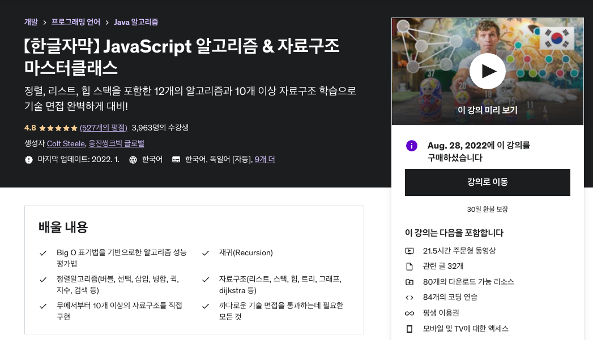

2020, 2021년도에는 그래도 월별이나 분기별로 회고를 작성했던 것 같은데, 올해는 회고를 많이 작성하지 못한 편이라 2022년 회고에서 월별로 조금씩 나누어서 정리해봐야겠다! ~~그리고 아마 앞으로는 연간회고가 되지 않을까 싶기도 하고 ㅎㅎ~~

월별로 기록하기 이전에 2021년 회고에서 다짐했던 일들을 잘 지켰나 살펴볼까 🤔

1. 꾸준히 운동하기

   이건 나름 잘 지킨 것 같다. 원래는 주짓수를 했었는데, 일을 시작하고 자주 못가면서 꾸준히 운동하는 것을 계획으로 세웠었었다. 꾸준히 운동하기 위해서 주짓수에서 새벽운동이 가능한 크로스핏으로 바꾸었고, 그래도 나름 주 4회정도 가면서 꾸준히 하고 있다!

2. 월간회고 작성 & TIL 블로그 한달에 2번 이상 글쓰기

   위에서도 말했지만, 월간회고는 거의 못했고... 블로그에 글 쓰는 것도 지금 세보니까 회고 제외하고 11개 정도 쓴걸로 봐서는 한달에 2번은 아니고 한 번 정도는 그래도 쓴듯? ㅎㅎ

3. 클린코드, 리팩토링 2판 읽기

   와... 이건 하나도 못읽었다 진심. 클린코드랑 리팩토링 2판 읽으려고 심지어 둘다 책읽기 강의라고 해야 하나 그것도 사놨는데 책도 못읽고 강의도 못듣고...ㅎ 그나마 읽은 책은 스터디를 했던 자바스크립트 Deep Dive와 이펙티브 타입스크립트 이렇게 2권인 것 같다. 책 종류가 전혀 다르긴 하지만 그래도 2권은 읽었다는 것에 의의를 둬야하나.... 쨋든 이 2권 책은 2023년에도 목표로 삼아야겠네.

4. CS 지식 공부하기

   쉽게 배우는 운영체제라는 책을 좀 읽고, CS지식 겸 해서 JS 자료구조 강의도 좀 들으려고 했는데... ㅎㅎㅎ 뭔가 2022년에 열심히 산거 같긴한데 공부를 진짜 많이 못했네ㅜㅜ 반성해야겠다...

5. 월급 50% 저축하기

   50%까지는 저축 못하고... 그래도 1/3은 한 거 같은데 음. 근데 2022년에는 딱 기본적인 것만 한거 같아서 올해는 좀 더 모아야지 싶고. ~~그래야 독립하지..~~

작년의 나보다 더 많은 성장을 하기를! 이라는 표현에는 뭔가 그래도 긍정적으로 대답하고 싶다. 확실히 일을 통해서만 배울 수 있다는게 뭔지 체감하는 한 해였고, 그렇기에 그 전에 프로젝트나 강의를 통해서만 배우던 지식과 다른 지식을 많이 체득할 수 있었다. 이제 드디어 일을 좀 하는 듯한 느낌이 드는 것 같기도 하고 ㅎㅎ 쨋든 이건 아래서 월별로 정리하다보면 더 잘 느껴질 것 같다.

## 1월

2021년 12월에 지금 다니고 있는 회사에 입사해서 처음으로 맡은 일이 고도몰로 만든 스토어 페이지 스타일을 개선하는 일이었다. 웹서비스의 스택은 React였는데, 스토어 서비스는 고도몰 서비스를 이용하다보니 React를 이용할 수 가 없었고 그렇다고 HTML, CSS, JS만을 이용해 기존 서비스와 스타일을 맞추는 건 시간이 너무 오래 걸렸다. 그래서 그 때 사용했던 방법이 vue를 이용해서 서비스의 같은 스타일의 컴포넌트를 만들어 라이브러리로 배포한 후 고도몰에서 라이브러리를 다운받아 사용하는 방식이었다. 쨋든 12월에 온보딩 이후 위에서 설명한 스토어 서비스의 스타일 개선 위주로 작업을 했고, 1월에도 거의 비슷한 작업을 했다. 일이 많기도 했고, vue를 처음 쓰고 내가 업무에 서투르다보니 조금 느리기도 했고.

그 외에는 지금 이 블로그 말고 그 전 블로그였던 Jeykyll 블로그를 설 때 만들었었다. 국비학원 다닐 때 Gatsby 블로그를 만들었는데, 그게 배포가 안되면서 결국 Jeykyll로 블로그를 새로 만들었던 건데, 음 뭐랄까 좀 못생겨서...? 그리고 커스텀하기가 너무 불편해서 현재는 지금 이 블로그인 Gatsby 블로그로 다 시 넘어왔다. 근데 시간이 없어서 진짜 기본적인 것 밖에 안 만들어두어서 올해에는 블로그 SEO랑 자기소개 페이지랑 이것저것 커스텀을 좀 해야지 싶다.

## 2월

스토어 서비스의 스타일 개선을 하는 작업이 어느정도 마무리된 후, 이제 현재 서비스의 V2 버전을 맡게 되었다. 기존 V1 서비스가 느리기도 했고, 기술부채가 많이 쌓이면서 유지보수하기가 어려워져서 아예 V2로 넘어가기로 한 것이었다. 아직 시안이 제대로 나오거나 한 상태는 아니여서 아마 이때는 V1 서비스의 로직을 분석하고, Next, Jotai 등 제대로 안써봤던 스택들을 공부하면서 시간을 많이 보냈던 것 같다.

Next도 제대로 써본 적이 없었어서 노마드코더의 'Next.js + React18을 위한 캐럿마켓 클론코딩' 강의도 시작했는데 아직 다 못들었다...ㅎㅎ 예전에는 시간이 많아서 강의를 처음부터 끝까지 다 들을 수 있었는데, 요즘은 필요한 부분만 선택적으로 듣는 느낌이다. 아마 Next.js 관련 부분은 다 들었던 거 같은데 백엔드 파트는 당장 필요하지 않아서 건너뛰었다...

## 3월

3월은 2월이랑 약간 비슷한데, Next, Jotai, Tailwind 등 새롭게 적용할 스택들을 공부했고 시안이 크게 필요없는 부분들은 개발도 시작했다. 이때까지만 해도 아래 이미지처럼 Jira를 썼었는데, 새삼 불편하다 싶다. 지금은 Basecamp를 쓰는데, Jira보다 훨씬 편하달까!

아, 그리고 3월에는 코로나도 걸렸었다. 조심한다고 했는데, 가족 중 한명이 먼저 걸려버리니까 조심할 수가 없더라ㅜㅜ 쨋든 덕분에 가족 4명 다 걸렸었고, 내 연차는 다시 마이너스가 되었다...ㅜㅜ

## 4월

4월에는 3월과 비슷하게 보냈다. 위 Jira 이미지가 아마 4~5월도 포함된 것 같다. 조금 달라진 점은 아마 4월부터는 시안이 나오기 시작해서 UI 컴포넌트 위주로 만들고, 덕분에 Storybook 사용도 하고, UI 레포를 라이브러리로 배포하면서 사용하느라 라이브러리 배포도 자주 하고 그랬었던 차이 정도?

그리고 생일이 있기도 했고, 엄마가 5월부터는 아빠 따라 제천으로 이사간다는 사실에 주말마다 엄마랑 놀러다니기도 하고 그랬다. 물론 지금와서 하는 말이지만, 엄마는 서울토박이로 한 달만에 지방 생활이 잘 맞지 않기도 했고, 거기서 하시는 일도 육체적으로 많이 힘들어서 다시 왔따...ㅎㅎ

## 5월

5월에도 여전히 서비스 리뉴얼을 했는데, 큰 차이가 있었다. 바로 시니어 개발자 분이 한 분 더 들어오시게 되었는데, 그 덕분에 제대로 된 코드리뷰를 받기 시작했다. 그 전에는 약간 코드의 품질보다는 동작 위주로 코드리뷰를 받고 그래서 PR을 올려도 금방 통과되고 그랬는데, 이제는 코드 품질 자체를 리뷰를 받다보니까 코드를 짜면서 안좋은 습관들이 많이 고쳐졌다. 예를 들자면, 변수명을 지을 때 idx, cnt처럼 축약하거나 제대로된 의미를 전달하지 못하게 작성하거나 하는 경우가 많이 줄어들었고 이전에는 dynamic하게 개발하지 못했었는데 이 점도 많이 좋아졌다. 예를 들자면, 예전에는 비슷한 UI 컴포넌트 A,B,C 세 곳의 페이지에서 사용하다면 A, B, C 이렇게 페이지 타입을 넘겨서 페이지별로 다른 UI 컴포넌트가 나오게끔 만들었다면 이제는 UI 컴포넌트의 요소별로 prop을 만들어서 A, B, C 페이지에서 UI 컴포넌트를 사용할 때 직접 결정할 수 있도록 한다. 예를 들자면, 버튼을 보여줄지 말지나 세로로 보여줄지 가로로 보여줄지 이런 것들! Dynamic하게 작성하면 좋은 점은 일단 가독성이 좋아진다. 굳이 구현부로 들어가지 않아도 prop을 어떻게 주었는지만 확인해도 어떤 UI가 보일지 어느정도 예상이 가게 된다. 만약 페이지로 넘긴다면 구현부를 보거나 시안을 보거나 하는 등의 추가 확인을 하지 않는 이상 전혀 어떤 UI일지 예상이 안되는데 말이다. 그 외에도 추가 페이지가 생기더라도 UI 컴포넌트를 수정할 일도 많지 않다.

쨋든 2022년 한 해 중에서 5월이 코드리뷰 덕에 가장 많은 스트레스르 받았고, 가장 많이 성장했던 시간이었다.

## 6월

6월부터는 스프린트가 아닌 Shape-up 방식으로 프로젝트 개발 관리를 하게 되었다. Shape-up의 첫 Cycle이 6월 중순부터 시작되었고, 한 Cycle은 6주 동안의 개발과 2주 동안의 쿨링으로 구성된다. 내 첫 Cycle 목표는 2월부터 시작했던 서비스 리뉴얼을 배포하는 것이다. 7월 말에 배포하는 것을 타겟으로 설정하고 시작했는데, 그 전에는 마감 없이 개발을 해서 그래도 조금 마음이 편했다고 해야되나... ㅎㅎ 쩃든 그랬다면 이제는 마감이 딱 정해져서 야근도 많이 하고 그랬던 것 같다.

아, 그리고 미들급? 프론트엔드 개발자 분이 새롭게 한 분 오셨다! 그 분도 비전공에서 시작하셨는데, 진짜 깊이가 엄청 나서 그 당시에도 개발자로써 닮고 싶다고 생각했고, 지금도 그렇다. 나도 그 연차 쯤에는 그렇게 성장할 수 있을까..! 회사에 계속 좋은 분들이 많은 만큼 나도 그런 사람이 될 수 있도록 꾸준히 성장해야지 싶다.

마지막으로 6월에는 소프트웨어마에스트로에서 Expert를 시작해서 새로운 13기 연수생 친구들과 만나는 시간을 가졌다. 처음에는 내가 Expert를 한다고? 이랬는데, 약간 소마 선배 느낌으로 한다면 해줄 수 있는 이야기가 많을 것 같고 나도 다른 친구들과 만나면 재밌을 것 같았다. 그렇게 6월부터 팀당 3번씩 그렇게 한달에 최대 6번까지 만날 수 있는데, 6월에는 바빠서 3번까지 밖에 못봤다 ㅜㅜ

## 7월

7월 말에는 Cycle1이 개발 기간인 6주가 종료되어 배포되었어야 했는데, 마무리가 덜 되어서 2주 연장되었다. 그렇게 7월 한 달 동안 리뉴얼 작업 마무리하고, 회사도 드디어 가산디지털에서 역삼으로 이사가게 되었다!! 일단 무엇보단도 통근 시간이 절반으로 줄어들어서 너무 좋았다.

그리고 7월에는 갑자기 입술이 부어서? 응급실도 다녀왔는데 알러지 반응 같다고는 했는데 검사해도 결국 아무것도 안나왔다...ㅜㅜ 진짜 이러다 입술 터지는거 아니야 싶을 정도로 심하게 부었는데, 다행히 그 뒤로는 똑같은 증상이 없어서 그때 병원에서 받은 비상약은 고이 간직 중이다. 그때 스트레스도 좀 받고, 약속도 많아서 유독 피곤하긴 했었는데 그게 이유였나 싶기도 하고... 쨋든 그 때 이후로는 약속은 일주일에 2번까지만 잡을려고 노력중이다.

## 8월

8월에는 드디어 Cycle1이 종료되고, V2를 배포했다. 배포 후 버그를 받기 시작했는데, 생각보다 자잘한 버그가 꽤 많아서 배포 후 남은 8월은 버그 픽스하느라 시간을 다 보낸 것 같다.

그리고 8월부터는 업무일지도 쓰기 시작했다. 그전에는 재택하는 날에만 재택 기록을 위해 업무 일지를 작성했는데, 그러다보니 무슨 일을 했었는지 기억도 안날 때가 많고 무엇보다 기록이 여기저기 있다보니 찾기가 힘들어졌다. 그 때 다른 분이 업무일지를 쓰는 것을 봤는데, 꽤 괜찮아 보여서 나도 작성하기 시작했다!

일주일 단위로 페이지를 만들고, 그 안에서는 todo 형식으로 매일 아침 할 일을 적으면서 시작하는데 생각보다 괜찮은 방법 같다!

## 9월

9월에는 새로운 Cycle을 시작했고, 기존에 CM팀에서 사용하는 콘텐츠 에디터에 새로운 컴포넌트를 추가하는 업무였다. Chart.js라는 라이브러리를 이용해서 방사형 차트도 그리고 UI 컴포넌트를 구현하는 업무여서 꽤 재밌게 했던 것 같다. 그러고보니가 Chart.js 라이브러리로 방사형 차트 그리느라 고생 좀 해서 블로그 글로 적어야지 했는데, 못적었다...ㅎㅎ

아 그리고, 이쯤 이펙티브 타입스크립트 라는 책으로 사내 스터디를 처음 했었다! 스터디 아니였으면 2022년에 책 진짜 못읽었을 것 같다. 그 때도 와 바쁘다.. 이러면서 책을 겨우 읽고 주말에 미친듯이 읽고 그랬었던 기억이 나서...ㅎㅎ 그래도 이때는 스터디가 있으니까 주말에 시간내서 공부하고 그랬는데 요즘은 주말에 자기 바쁘넹...?

9월 말에는 처음으로 회사에서 워크샵을 했었다. 그 전에는 개발팀 외에는 말을 할 기회가 거의 없었는데, 확실히 워크샵 이후로는 좀 더 친해진 느낌이다! 1월에 또 워크샵 했으면 좋겠다~~

## 10월

10월 초에는 리프레시 휴가 3일을 이용해서 엄마랑 제주도 다녀왔다. 여행 좋아하는 편인데, 엄마랑 둘이 여행을 간 적은 한 번도 없어서 걱정반 기대반이었는데 생각보다 재밌었고, 올해는 해외로 다녀와볼까 생각 중이다! 가능하면 태국으로 ㅎㅎ

## 11월

6월부터 했던 소마 Expert 활동이 11월로 마무리되었다. 6개월이라는 짧다면 짧고, 길다면 긴 시간동안 13기 연수생들과 같이 시간을 보낼 수 있었는데, 그 덕분에 나도 21년도에 소마를 했던 기억들도 많이 나고 그랬다. 여름쯤에 팀원들과 봤었는데, 연말에 못봐서 올 초에는 한번 보자고 연락해야지 싶네!
그리고 내년에도 Expert를 모집한다면 아마 또 하지 싶다 ㅎㅎ Expert를 하면 아무래도 바쁘긴 한데, 그래도 그만큼 뿌듯한것도 많다. 활동비도 받긴 하는데, 커피사고 밥사고 하면 음 뭐 활동비야 적당히 받는 느낌이곸ㅋㅋㅋ ~~그래도 활동비 좀 올려줬으면ㅎㅎ~~

아 그리고 소마 인터뷰도 했다. 사무국에서 선정해서 따로 연락을 받았는데, 생각보다 재밌었다. 나에게 소마란? 이란 질문을 갑자기 받기도 했고, 제일 오래 고민했던 거라 기억이 남는데 결국 미루고 미뤘는데도 좋은 생각이 안나서 '자신감'이라 대답했다. 그냥 그게 제일 솔직한 답변이었달까. 아무것도 모르는 문과생이 6개월동안 국비학원에서 파이썬 조금, 자바 조금, SQL 조금 배워놓고 제대로된 프로젝트 경험없이 운좋게 소마 들어왔고, 소마에서 좋은 사람들과 함께 프로젝트 열심히 하고나니 소마 인연으로 지금의 회사까지 올 수 있었다. 솔직히 소마 아니였으면 개발자로서의 자신감이 많이 부족했을 것 같은데, 그래도 소마 덕에 나도 회사에서 일을 시작할 수 있지 않을까라는 자신감을 얻었달까. 아 그래도 좀 더 좋은 답변 없었을까 싶긴 한데...ㅋㅋㅋ 아 그리고 문제는 사진을 회사에서 찍었는데, 진짜 너무나도 어색하게 찍힌게 느껴져서 사진이 공개 안됐으면 좋겠다 진심으로..... 어딘가 블로그나 이런데 올라오거나 하지 않겠죠.....ㅎㅎ 진심 너무 어색 그 자체였는데. 추억이라면 추억이고....ㅎ

## 12월

9월에 사실 나랑 입사했던 분이 다른 곳으로 가게 되었는데, 그 분이 맡았던 프로젝트를 내가 인수인계 받았었다. 그 프로젝트를 이제서야 다시 하게 되어서 걱정 많이 했는데, 그래도 12월에 무사히 배포까지 끝났다. 약간 다사다난했던 프로젝트였는데, 그래도 일단 배포까지 하고나니 한 시름 놓인달까. 이 프로젝트 덕에 Cycle3에서는 쿨링도 없이 진짜 쉬지않고 달렸다... 덕분에 감기도 걸렸던 것 같고.

아 진짜 왜 스트레스 받은 상태에서 좀만 무리하면 아픈거지ㅜㅜ 건강 관리 잘 해야하는데, 여기서 운동을 더 늘릴 수도 없고... 스트레스 관리 어떻게 하면 잘하나요...ㅎㅎ 진짜 스트레스 관리 좀 잘해야지 싶다.

---

이렇게 적고 나니까 2022년에는 일, 소마, 운동으로 가득 찼던 것 같다. 뭐 중간중간에 친구들 만나서 보드게임도 하고, 방탈출도 하고 그랬지만 개인 약속은 예전에 비하면 진짜 많이 없는 편이랄까. 뭔가 개발 쪽을 공부하기 시작한 이후로는 매일 매일이 시험기간스럽다. 공부는 안하면서 공부해야지 하는 그런 심정...?ㅎㅎ 진짜 약속도 잘 못잡고, 좋아하는 영화도 자주 못보고 그러면서 공부는 열심히 하니? 하면 그렇다고 엄청 열심히 하는 것도 아니고.. 딱 시험기간스러운 마음과 행동을 많이 했는데, 그러다보니 조금씩 지친 것도 있는 것 같다. 2023년에는 시험기간 마음가짐에서 좀 벗어나봐야지. 좀 더 계획적으로 공부할 수 있는 시간은 정해놓고 공부 좀 하고, 그 외에는 그냥 푹 쉬어야지. 그래야 이도저도 아닌 생활을 조금은 벗어날 수 있을 것 같다.

## 그래서 2023년에는!

1. 운동 꾸준히 하기(크로스핏 주 4회 가기)

   아무리 바빠도 운동은 중요한 것 같다. 체력이 있어야 뭐든 하니까. 그니까 바쁘더라도 운동은 꼭 해야지. 그리고 가능하면 주짓수도...? ~~가능할까~~

2. TIL 블로그 한달에 1번 이상 글쓰기 && 블로그 프로필 페이지 만들기

   솔직히 월간회고는 못 쓸 것 같고, 한달에 2번 글쓰는 것도 어려워보이니까 한달에 한번이라도 글을 써보자. 그리고 프로필? 이력서? 페이지 만들기! 이력서는 항상 꾸준히 업데이트해야 된다고 하는데, 지금 블로그에는 그 페이지 자체가 없어서 일단 그것부터 만들고, SEO 깨지는 것 좀 고치고!

3. JS 알고리즘 & 자료구조 강의 듣기

   알고리즘이랑 자료구조는 더 이상 미루면 안될 것 같다. 올해는 천천히라도 이거 완강하는 걸 목표로.

   

4. Flutter로 앱 출시하기

   현재 생각중인건 크로스핏 운동 기록?인데, 그냥 나만 써도 좋다는 생각으로 앱 하나 만들어서 출시해보자. RN은 진짜 너무 힘들었으니까, 요즘 대세인 Flutter 한번 써봐야지.

5. 해외 여행 다녀오기

   나는 여행 다녀오면서 몸이 회복되는 편인 것 같아서 올해는 해외 한번 다녀와야지 싶다. 그리고 국내로 혼자 여행도 한번 다녀오면 좋을듯! 혼자 여행간지도 꽤 오래된 것 같아서 ㅎㅎ

6. 월급 50% 저축하기

   작년에는 못지켰지만, 다시 한번 해보자. 작년처럼 정기적인 부분 다 저축하고, 비상금 정도 만들면 될 것 같은데..!

쨋든 작년처럼, 작년보단 더 많은 성장을 할 수 있는 올해이기를!
