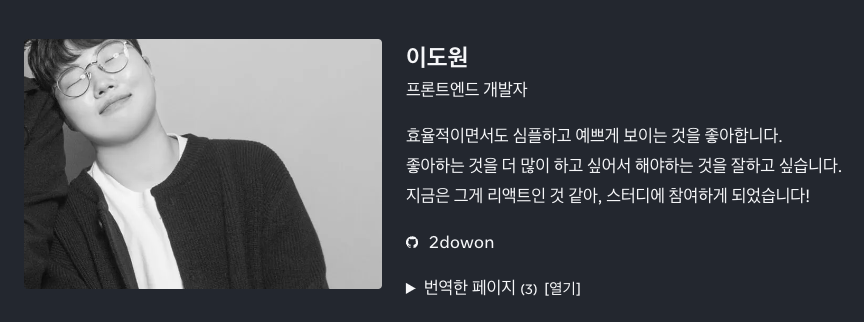

# 2023년을 보내며

월마다 회고를 작성하던 날들도 있었는데, 작년에는 회고를 하나도 작성하지 못했다. 그렇지만 다른 회고도 아니고, 연간 회고는 작성해야지!

이전에는 보통 월마다 무슨 일이 있었는지 정리하는 일기 느낌의 회고였다면, 올해부터는 변화에 좀 더 초점을 맞춰서 작성해볼까 싶다. 회고 작성하기 전에 다른 분들의 회고도 많이 봤었는데, 그 중 [진유림님의 회고](https://milooy.github.io/life/2023-review/)를 재밌게 읽었고, 정리도 깔끔하다고 생각이 들어서 해당 회고처럼 이번 회고는~~(앞으로도?)~~ 올해의 커리어 변화와 올해의 개인적 변화를 메인으로 써봐야겠다.

(아, 이미 회고를 작성하는 지금은 2023년이 올해가 아니지만, 그래도 2023년 회고이니 아래부터는 2023년을 올해라 부를 예정!😉)

# 올해의 커리어 변화

## Flutter

올해 커리어 변화 중 제일 큰 변화를 말하라고 하면 단연 ‘Flutter’이다.

노써치 앱이 기존에도 있었지만, 웹 서비스를 메인으로 했고 앱 개발자가 없었기 때문에 기존 앱은 webview로 만든 웹앱이었다. 그러다보니 앱임에도 불구하고 반응속도 등 성능이 좋지 않았고, 앱다운 경험을 유저에게 제공하지 못했었다. 앞으로 노써치의 방향에는 ‘유저와 함께하는’이 큰 가치로 있는 만큼 유저가 좋은 경험을 줄 수 있는, 편하게 사용할 수 있는 앱으로 리뉴얼할 필요가 있었고, 회사에서는 이를 위해서 웹앱이 아닌 Flutter native 앱으로 개발한다는 의사 결정을 하게 되었다.

근데 문제는 Flutter 개발자가 우리 회사에는 없는걸…?🤔 그치만 당장 Flutter 개발자를 데려올 수 있는 상황도 아니었고 나는 소마 프로젝트에서 React Native 경험이 약간 있었는데, 그 덕에 회사 시니어 분과 함께 Flutter 앱 개발에 투입되었다.

새롭게 배우는 걸 좋아하기도 하고, React로는 귀찮게(?) 만들었던 UI들이 Flutter에서는 widget을 잘 쓰기만 해도 더 빠른 시간 내에 만들 수도 있었고 나름 재밌었다. ~~(공부할 것도 많고, 모르는 것도 많은 탓에 야근은 진짜 많이 했지만…)~~ 그렇게 작년에는 2월부터 시작해 지금까지도 중간에 웹뷰 성능 개선을 위해 한두달 정도 Next12에서 Next13 마이그레이션하는 작업을 제외하면 거의 1년 내내 Flutter 앱 개발만 했다. 그러다보니 처음에는 ‘재밌다’로 시작했지만, 솔직히 점점 ‘불안함’의 감정이 커졌었다. 웹 개발자로서의 커리어가 꼬인다고 생각했다. JS, TS, React, Next를 메인으로 하는 웹 개발자였는데, Flutter를 사용하는 시간이 길어질수록 나는 더 이상 웹 개발자가 아닌 앱 개발자인가 싶기도 하고, 웹 개발을 하고 싶다는 생각에 잠깐은 회사 일이 하기 싫었던 순간도 있고 그랬던 시기가 있었다. ~~(솔직히 이직해야 하나 싶기도 했고, 주변에서 이직하라는 소리도 많이 듣기도 했고…)~~

나름 고민이 많았던 그 시기에 시니어분들과 1on1을 진행하면서 이런 고민들에 대해 얘기를 했었고, 그 때 들었던 얘기 중 기억남는 것이 ‘프레임워크 개발자가 되고싶어요?’ 라는 질문이었다. 지금은 프론트엔드 개발에서 TypeScript, React, Next를 주로 사용하지만 내가 취준하고 입사할 당시만 해도 TypeScript와 Next는 메인이 아니였다. 불과 2년전인데 말이다. 프레임워크는 끊임없이 변하는데, 지금 당장 시장의 메인스트림 스택을 회사에서 메인으로 사용하고 싶어요,는 어쩌면 욕심이었을지도 모른다. <mark>회사에서 Flutter를 사용하고 있지만, 사실 1년 동안 Flutter를 사용하면서 Dart와 Flutter의 문법보다도 많이 배운건 ‘개발적 사고’이다.</mark> 처음 사용해보는 기술을 써보는 만큼 모르는 것도 많았고, 그 과정에서 어려움도 많았다. 그런 상황에서 모르는 것을 어떻게 알아가는지에 대한 태도와 접근 방식을 사실 제일 많이 배웠다.

이렇게 글로 남기고 나니까 나름 가벼웠던 문제처럼 보이는데, 그 당시의 나한테는 꽤 큰 고민이었다. 재밌지만, 하기 싫은 애증의 관계같은 Flutter 덕에 사실 작년에 블로그 글을 남기려면 Flutter 주제로 남길 수 있었을텐데 괜히 또 쓰기 싫고 그러더라…ㅎㅎ 물론 지금은 작년만큼 Flutter가 하기 싫거나 하진 않지만, 그래도 React, Next가 더 하고 싶어서 시니어분과 1on1 할 기회가 생기면 그떄마다 하고 싶다고 외치는 중이다. 그치만 하고 싶을 때 잘하려면 시간날 때 틈틈히 React, Next 공부 좀 해야지 싶다! Next가 벌써 14가 나왔더라…🫠

## 스터디

올해에는 다른 때에 비해서 스터디나 개인적인 공부를 많이 못했던 해인데, 그래도 돌아보니 2개는 참여했었다. 문제는 2개 다 엄청 열심히 참여했나?라고 물으면 그렇다고 대답은 못하지만 그래도 사람들이 많이 남았던 그런 스터디였다. 둘 다 더 열심히 참여하고 그랬으면 좋았겠지만, 그래도 그 당시 주어졌던 시간에 나름 최선을 다했었고 아예 하지 않는 것보단 그래도 하는게 좀 더 낫다는 것을 알게 된 기회이기도 하고!

### 리액트 공식문서 번역 스터디

[리액트 공식문서 번역 스터디](https://react-ko.dev/)는 올해 3월부터 5월 중순까지 진행했던 스터디로, 인프런에서 네이버의 정재남님께서 스터디를 모집해 참여하게 되었다. 2월부터 Flutter를 개발하면서 그새 또 리액트가 쓰고 싶다는 생각에 참여했던 스터디였고 초반에는 아는 내용도 많고 상대적으로 회사 일도 조금 덜 바빠서 열심히 참여했었다. 근데 4월이 되어가면서 회사 앱 출시 직전이 되면서 회사 일이 진짜 너무 바빠졌고, 스터디 시간은 9시 시작인데 끝나기 직전인 10시반에 겨우 참석하는 날들이 점점 많아졌다.

그래서 번역 스터디임에도 불구하고, 아래 보는 것처럼 3개의 글 번역에 밖에 참여하지 못했던 것도 아쉽고 스터디 자체에 열심히 참여하지 못했던 것도 많이 아쉽다.

그래도 해당 스터디에 모였던 사람들 모두가 프론트엔드 개발에 관심이 있는 사람들로 구성된만큼 스터디가 끝난 이후에도 공간을 빌려서 FECONF 2023~~(이거 대체 누가 예약 성공하는걸까…)~~을 같이 보고 의견도 나누고 맥주도 한 잔하고 그런 시간을 가지기도 하고, 스터디가 끝나고 바로 끝!이 아니라 사람이 남는 스터디인만큼 더 많이 참여해서 더 많은 사람들과 함께 할껄 하는 아쉬움이 또 남는…

### React-World

올해 8월부터 9월 사이에는 29CM의 파랑님이 주최한 [React-World 스터디](https://github.com/pagers-org/react-world)에 참여했다. 다른 스터디들과 다르게 무언가를 공부하는 스터디보다는 RealWorld를 직접 구현해보면서 팀원들과 함께 또 같이 할 수 있는 그런 스터디였는데, 우리는 너무 잘 맞는 팀을 만나서 하고 싶은게 너무 많고도 명확했고 그 결과 많은 의견을 나누었지만 실제로 RealWorld를 완성하지는 못했었다. 그렇지만!! 다른 사람들과 함께 프로젝트를 구현하기 전에 어떤 스택을 사용하고, 어떤 규칙을 정해서 개발할 것인지를 충분히 논의하는 시간은 꽤나 가치가 있었고 재미있었다!

아, 그리고 어쩌다보니 작년에 소마 Expert 활동을 할 때 멘티?라고 하면 거창하긴 한데, 내가 맡았던 팀의 프론트엔드 연수생분도 이번 스터디에 참여하셨고 같은 팀까지 되었었다. 그리고 또 다른 한 분은 리액트 공식문서 번역 스터디에서 만났던 분이였다. 이럴 때마다 은근 좁다?라는 생각도 하게 되는 것 같고, 좋은 인연으로 남을 수 있도록 항상 잘해야겠다는 생각도 든다.

## 소마 Expert 활동

2021년도에 소마 12기를 수료한 이후, 2022년과 올해까지 운이 좋게도 소마 Expert 활동을 할 수 있었다. 특히 이번 소마 Expert 활동은 작년과는 다르게 예비 연수기간부터 연수생 분들을 만날 수 있어서 좀 더 많은 얘기를 나눌 수 있었다. 작년에도 재밌게 활동했지만, 다 컴공 출신의 연수생분들이 많았어서 이런 얘기를 해주고 싶어서 지원했던 나의 생각과는 다르게 기회가 없었지만 그래도 이번에는 문과 비전공자에 국비학원 출신이 갑자기 소마에 합격하면서 겪었던 어려움이나 불안감과 관련한 얘기들을 많이 해줄 수 있었던 것 같다.

그 외에도 이번에는 맡을 연수생 팀 권한?이 나한테도 있었는데, 그러다보니 조금 더 나와 잘 맞을 것 같은 팀들과 함께 할 수 있게 되었고 그 덕분에 좀 더 재밌게 시간을 보냈던 것 같다. 예비 연수기간부터 활동이 시작된만큼 연수활동이 끝날 때까지 자주 보지 못한 것은 아쉽지만, 그래도 소마 수료 이후에도 한 번 만나서 근황도 들을 수 있고 그래서 좋았다 ㅎㅎ

# 올해의 개인적 변화

## 운동

크로스핏은 작년부터 시작해서 올해도 꾸준히 다녔다. 작년에 주 4회를 목표로 했는데, 사실 4회까지는 못하고 주 3회 갔을 때가 제일 많았던 것 같다.

그 이유 중 하나가 농구를 시작했기 때문도 있다. 농구는 사실 중, 고등학생 때 꽤나 열심히 했었는데 성인이 된 이후에는 할 기회가 없어서 거의 못했었다. 그러던 중 농구 동호회를 하나 알게 되었고, 바쁘다는 이유로 못 가다가 올해 1월쯤 여유가 있는 것 같아서 나가게 되었다. ~~이때까지만 해도 내가 앱 개발을 하면서 미친듯이 바빠질 줄 몰랐지.~~

그래도 주 1회 정도는 농구가고, 주 3회 정도는 크로스핏 가면서 꾸준히 운동 다녔던 것 같다. 아무래도 내가 좋아하는 운동 특성상 사람들과 하는 운동이다보니 다양한 사람들을 만나면서 기분 전환도 되고, 무엇보다 운동하는 동안에는 ‘죽겠다’는 생각 밖에 안들어서 그니까 다른 생각을 할 수가 없어서 생각보다 스트레스도 풀린다. 내년에도 운동은 꾸준히 해야지!

## 사람

2023년에는 다양한 사람을 많이 만났던 해같다. 2021년도에는 소마 활동을 하면서 많은 사람들을 만났지만, 그래도 코로나 시즌이였어서 많은 사람들을 만날 기회가 많았음에도 제한적으로 만날 수 밖에 없었다. 그리고 작년에는 회사에 막 들어와서 적응할 때이고, 국비학원을 다니고 소마 활동을 하는 동안에는 개인적으로 친구들과 많이 만나지 못했던 만큼 못 만났던 친구들을 만났었다. 그러다보니 새로운 사람들을 만날 시간적 여유가 크게 없었는데, 그래서인지 올 초부터는 새로운 사람들을 만나고 싶어했던 것 같다. 그래서 농구 모임도 들어가고, 외부 스터디도 하는 등 여러 활동을 하지 않았을까!

그 과정에서 소중한 사람들도 많이 생겼고, 조금은 더 현재보다는 미래를 볼 수 있게 되었다. 그 전에는 너무 현재를 잘 살려고 노력하는 탓에 미래를 많이 바라보지 못하고 달리느라 바빴다면, 지금은 그래도 미래를 같이 생각하면서 현재를 달리는 느낌이랄까!

그치만 사람들과 행복한 탓에 현재에 안주하지는 말아야지. 행복하다고 그 순간 멈춰버리면 꼭 나중에 후회하더라. 후회의 순간들도 이전에 많이 겪었으니 이제는 더 이상 겪지 않고 잘 밸런스 맞추면서 나아가봐야지.

## 여행

소중한 사람들과 시간을 많이 보냈던 덕분에 올해는 여행도 많이 다녀왔다. 코로나 이후 오랜만에 갔던 해외여행인 일본 오사카 여행부터 제주도, 강릉, 춘천, 양양, 대전, 그리고 경기도 곳곳까지!

20대 초반까지만 해도 여행을 다닐 때 자유롭고 행복하다 느꼈던 것 같은데, 최근에는 여유가 없었던 탓에 많이 귀찮았던 것도 같다. 그래도 또 막상 다녀오니 좋은걸. 여유있을 때 소중한 사람들과 많이 다녀와야지.

# Goodbye, 2023

- 운동 꾸준히 하기
- TIL 블로그 한달에 1번 이상 글쓰기 && 블로그 프로필 페이지 만들기
- JS 알고리즘 & 자료구조 강의 듣기
- Flutter로 앱 출시하기
- 해외 여행 다녀오기
- 월급 50% 저축하기

2023년을 보내며 2023년 회고에서 작성했던 목표들인데, 블로그와 알고리즘 & 자료구조 강의 듣기 외에는 거의 이뤘던 것 같다. 운동도 농구랑 크로스핏을 꾸준히 했고, Flutter로 개인적인 앱은 아니지만 회사 앱을 출시했고, 해외 여행으로 엄마와 일본도 다녀왔다. 마지막으로 월급도 50%까지는 아니지만…! 그래도 나름 열심히 저축하려고 노력했고!

블로그 글 쓰기와 프로필 페이지 만들기는 좀 아쉬운데, 2024년에는 좀 더 블로그에 정을 붙일려고 2024년 초부터 도메인도 연결하고 스타일도 좀 더 커스텀하고 공을 들이는 중이다. JS 알고리즘과 자료구조 강의도 사실 요즘 회사 시니어분에게 CS 기초 관련해서 피드백을 종종 받고 있어서 시간내서 해야지 했던 부분 중 하나인데, 시간내서 듣기 쉽지 않았다. 그래도 CS 기초 지식을 더 이상 미룰 수는 없어서 방통대 컴퓨터과학과 3학년 편입 신청을 했었고, 그것도 이번주면 결과 나오네! 조금 늦더라도 천천히라도 하나씩 채워가야지.
